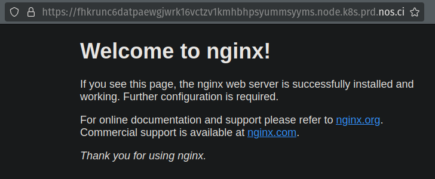
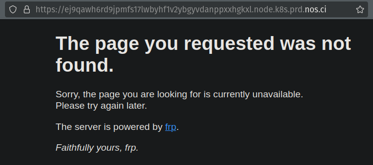

# Endpoints

Setting Up and Communicating with Endpoints on the Nosana Network

When posting a job to the Nosana network, it is possible to specify the duration for which you want your compute job to be available. This means an instance will be accessible via an endpoint with which you can communicate.

This guide will walk you through setting up an Nginx server and interacting with its endpoint. Afterwards, we will set up a Llama instance and start communicating with it.

## Proof of concept: Nginx

Nginx is a high-performance web server and reverse proxy server that is widely used for serving static content, load balancing, and handling HTTP and HTTPS traffic.
It'll be a good proof of concept to showcase how to use a Nosana endpoint.

1. Setting Up an Nginx Server

Step 1: Define the Job Schema
Create a file called nginx.json and copy the following JSON schema into it:

```json
{
  "version": "0.1",
  "type": "container",
  "meta": {
    "trigger": "cli"
  },
  "ops": [
    {
      "type": "container/run",
      "id": "nginx",
      "args": {
        "cmd": [],
        "image": "nginx",
        "expose": 80
      }
    }
  ]
}
```

This schema specifies the use of the Nginx image and exposes port 80.

Step 2: Post the Job
Run the following command to post the job to the Nosana network:

```sh:no-line-numbers
nosana job post --file nginx.json --market 97G9NnvBDQ2WpKu6fasoMsAKmfj63C9rhysJnkeWodAf
```

Once the job is running, you will see an output similar to this:

```sh:no-line-numbers
  _   _
 | \ | | ___  ___  __ _ _ __   __ _
 |  \| |/ _ \/ __|/ _` | '_ \ / _` |
 | |\  | (_) \__ \ (_| | | | | (_| |
 |_| \_|\___/|___/\__,_|_| |_|\__,_|

Reading keypair from /home/djmbritt/.nosana/nosana_key.json

Network:	mainnet
Wallet:		4WtG17Vn3SSoTAVvXxpopQTG3Qo9NUK28Zotv4rL1ccv
SOL balance:	0.05066028 SOL
NOS balance:	66.781499 NOS
ipfs uploaded:	https://nosana.mypinata.cloud/ipfs/QmTcNQ4dGq8veeg8v5cQyGoaJEPSYQnVTd1TvfckVFVzRu
posting job to market 97G9NnvBDQ2WpKu6fasoMsAKmfj63C9rhysJnkeWodAf for price 0.000115 NOS/s (total: 0.8280 NOS)
job posted with tx 4UJ7Ad84PkaxDvx7VQWwNfNia7M7E4WJQeAomjEuA8xn5V4T9QWbQtusJgsQUV9Dj9o8bs1FL6hJhhAPUrYeLVpF!
Service will be exposed at https://FhkRunC6dAtPaEWGJwRK16Vctzv1KmHBhpSyUmMsYyMS.node.k8s.prd.nos.ci
Job:		https://explorer.nosana.io/jobs/B3MmwHz7sovudYwMxZFwjS2E6eMRaEEqNgWao5RYUkLi
JSON flow:	https://nosana.mypinata.cloud/ipfs/QmTcNQ4dGq8veeg8v5cQyGoaJEPSYQnVTd1TvfckVFVzRu
Market:		https://explorer.nosana.io/markets/97G9NnvBDQ2WpKu6fasoMsAKmfj63C9rhysJnkeWodAf
Price:		0.000115 NOS/s
Status:		RUNNING

run nosana job get B3MmwHz7sovudYwMxZFwjS2E6eMRaEEqNgWao5RYUkLi --network mainnet to retrieve job and result
```

::: info
Take note of the following line in the output:
The service will be exposed at
https://FhkRunC6dAtPaEWGJwRK16Vctzv1KmHBhpSyUmMsYyMS.node.k8s.prd.nos.ci
:::

Navigate to this link to find your Nginx service.



Success! Your Nginx instance is running on the Nosana Network.

## Ollama Inference Endpoint

Now we will delve into how to setup an inference endpoint, where we will run an Ollama service and communicate with it.

Step 1: Define the Job Schema
Create a file named `ollama.json` and paste the following JSON schema into it:

```json
{
  "version": "0.1",
  "type": "container",
  "meta": {
    "trigger": "cli"
  },
  "ops": [
    {
      "type": "container/run",
      "id": "ollama",
      "args": {
        "cmd": [
            "-c 'curl -s https://raw.githubusercontent.com/KeesGeerligs/nosana/main/benchmarking/images/command.sh -o /tmp/command.sh && chmod +x /tmp/command.sh && /tmp/command.sh'"
          ],
        "image": "docker.io/nosana/ollama-7b:0.0.1",
        "gpu": true,
        "expose": 11434
      }
    }
  ]
}
```


This schema uses a Docker Ollama image provided by Nosana and exposes port `11434`. The cmd array initializes the Ollama service.

Step 2: Post the Job
Run the following command to post the job:

```sh:no-line-numbers
nosana job post --file ollama.json --market 97G9NnvBDQ2WpKu6fasoMsAKmfj63C9rhysJnkeWodAf
```

Please note that it can take up to 15-20 minutes for your endpoint to be available. The Nosana team is working on reducing startup time to a few seconds.

Once the job is running, you will see an output similar to this:

```sh:no-line-numbers
  _   _
 | \ | | ___  ___  __ _ _ __   __ _
 |  \| |/ _ \/ __|/ _` | '_ \ / _` |
 | |\  | (_) \__ \ (_| | | | | (_| |
 |_| \_|\___/|___/\__,_|_| |_|\__,_|

Reading keypair from /home/djmbritt/.nosana/nosana_key.json

Network:	mainnet
Wallet:		4WtG17Vn3SSoTAVvXxpopQTG3Qo9NUK28Zotv4rL1ccv
SOL balance:	0.05492696 SOL
NOS balance:	67.60951 NOS
ipfs uploaded:	https://nosana.mypinata.cloud/ipfs/QmcbDBHGVhdyYbUQs9sLwNzPUx1NcCoCXRWS7dA5VqJteZ
posting job to market 97G9NnvBDQ2WpKu6fasoMsAKmfj63C9rhysJnkeWodAf for price 0.000115 NOS/s (total: 0.8280 NOS)
job posted with tx 5q6FcG1pNP9JWpcXYud2zK6pvWcCSGNVoayPxTRHQkxQytpmJdVAqXa6E3xxunFS8iLXs6vBERhvfxFZQJcmDFyd!
Service will be exposed at https://B7hWYTyWHMLmYUH9sZFJL3TjgrHUAdDBi76xuEg9m9hX.node.k8s.prd.nos.ci
Job:		https://explorer.nosana.io/jobs/3Rraj6gcv9YRcm1Euk6vnkNrh385woLLXQzetCnsFkTz
JSON flow:	https://nosana.mypinata.cloud/ipfs/QmcbDBHGVhdyYbUQs9sLwNzPUx1NcCoCXRWS7dA5VqJteZ
Market:		https://explorer.nosana.io/markets/97G9NnvBDQ2WpKu6fasoMsAKmfj63C9rhysJnkeWodAf
Price:		0.000115 NOS/s
Status:		RUNNING

run nosana job get 3Rraj6gcv9YRcm1Euk6vnkNrh385woLLXQzetCnsFkTz --network mainnet to retrieve job and result
```

You can visit the service URL to check the status.



Initially, you might see a "Page not found" message. After 15 minutes, the Ollama service should be up and running, and you can start making requests to the endpoint.

::: info
Note the endpoint service url:
`https://B7hWYTyWHMLmYUH9sZFJL3TjgrHUAdDBi76xuEg9m9hX.node.k8s.prd.nos.ci`
:::

The Ollama service will run a server that is available at `/api/generate`.
Append `/api/generate` to the URL to communicate with the Ollama service.

## Client Example

Try these client examples to talk to your endpoint, remember to fill in the endpoint with your own endpoint.

:::: tabs

@tab cURL

Use the following curl command to post a JSON body to the endpoint:

```sh:no-line-numbers
curl -X POST https://8enyfpbp5pba3pwyexvhpw1jhfurou9tundyhdexfuuk.node.k8s.prd.nos.ci/api/generate \
-H "Content-Type: application/json" \
-d "{\"model\": \"gemma:7b\", \"stream\": false, \"prompt\": \"What is water made of?\"}"
```

@tab JavaScript

Alternatively, you can use JavaScript:

```js
import https from "https";

const data = JSON.stringify({
  model: "gemma:7b",
  stream: false,
  prompt: "What is water made of?",
});

const options = {
  hostname: "8enyfpbp5pba3pwyexvhpw1jhfurou9tundyhdexfuuk.node.k8s.prd.nos.ci",
  port: 443,
  path: "/api/generate",
  method: "POST",
  headers: {
    "Content-Type": "application/json",
    "Content-Length": data.length,
  },
};

const req = https.request(options, (res) => {
  let responseData = "";
  res.on("data", (chunk) => {
    responseData += chunk;
  });
  res.on("end", () => {
    console.log("Response:", responseData);
  });
});

req.on("error", (e) => {
  console.error("Error:", e);
});

req.write(data);
req.end();
```

::::

## Response

The endpoint should return a response like this:

```json
{
  "model": "gemma:7b",
  "created_at": "2024-07-19T13:03:07.217265645Z",
  "response": "Water is composed of two hydrogen atoms and one oxygen atom bonded together.",
  "done": true,
  "done_reason": "stop",
  "context": [
    968, 2997, 235298, 559, 235298, 15508, 235313, 1645, 108, 1841, 603, 2003, 1644, 576, 181537, 615, 235298, 559, 235298, 15508, 235313, 108, 235322, 2997, 235298, 559, 235298, 15508, 235313, 2516, 108, 11586, 603, 18588, 576, 1378, 20303, 25204, 578, 974, 16175, 24235, 74346, 3584, 35606, 615, 235298, 559, 235298, 15508, 235313, 108
  ],
  "total_duration": 47917239075,
  "load_duration": 47700638869,
  "prompt_eval_count": 32,
  "prompt_eval_duration": 60460000,
  "eval_count": 15,
  "eval_duration": 112647000
}
```

The service will be available for two hours before it gets taken down. Ensure you have enough NOS balance to cover this period; otherwise, you will be notified immediately.

Next up, we will go through the ins and outs of how to write a job, and the specifications you can customize for each job.
