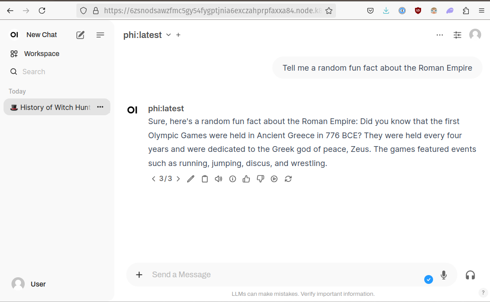

# Open WebUI


[Open WebUI](https://github.com/open-webui/open-webui) is an extensible, feature-rich, and user-friendly self-hosted WebUI designed to operate entirely offline. 
It supports various LLM runners, including Ollama and OpenAI-compatible APIs. 
With Nosana we can run an instance of Open WebUI and connect to it via a Nosana Endpoint.

## JSON Job Schema

::: info
Create a file named `stable-webui.json`, copy and paste the following into it:
:::

```json
{
  "version": "0.1",
  "type": "container",
  "meta": {
    "trigger": "cli"
  },
  "ops": [
    {
      "type": "container/run",
      "id": "open-webui",
      "args": {
        "cmd": [],
        "env": {
          "WEBUI_AUTH": "False",
          "WEBUI_NAME": "Nosana Chat"
        },
        "image": "ghcr.io/open-webui/open-webui:ollama",
        "gpu": true,
        "expose": 8080
      }
    }
  ]
}
```

## Command

Run the following command to post the job to the Nosana network.

```sh:no-line-numbers
nosana job post --file open_webui.json --market 97G9NnvBDQ2WpKu6fasoMsAKmfj63C9rhysJnkeWodAf
```

## Output

```sh:no-line-numbers
  _   _
 | \ | | ___  ___  __ _ _ __   __ _
 |  \| |/ _ \/ __|/ _` | '_ \ / _` |
 | |\  | (_) \__ \ (_| | | | | (_| |
 |_| \_|\___/|___/\__,_|_| |_|\__,_|

Reading keypair from /home/djmbritt/.nosana/nosana_key.json

Network:	mainnet
Wallet:		4WtG17Vn3SSoTAVvXxpopQTG3Qo9NUK28Zotv4rL1ccv
SOL balance:	0.04212692 SOL
NOS balance:	65.125477 NOS
ipfs uploaded:	https://nosana.mypinata.cloud/ipfs/QmajmxiSFDfaZ4YmwsV92iqCz8LPZyLjKjjfqJ6m7kgWjw
posting job to market 97G9NnvBDQ2WpKu6fasoMsAKmfj63C9rhysJnkeWodAf for price 0.000115 NOS/s (total: 0.8280 NOS)
job posted with tx 62TjXTM2rme78RCpM7pZ5YAkCHLmybqHvWrYfTigrjMooBqww99Qn1BoGWtkcWVA5CCuWy3H2PgANWr7PaqsWBtg!
Service will be exposed at https://ChiscJkoWFYwiZrCPzWd1wKBeDonMqaekq7eCAqTt1YC.node.k8s.prd.nos.ci
Job:		https://explorer.nosana.com/jobs/41s1bL8CYBctRgz6jCAYfUSxd8zueUkneHXHeMXVE3p5
JSON flow:	https://nosana.mypinata.cloud/ipfs/QmajmxiSFDfaZ4YmwsV92iqCz8LPZyLjKjjfqJ6m7kgWjw
Market:		https://explorer.nosana.com/markets/97G9NnvBDQ2WpKu6fasoMsAKmfj63C9rhysJnkeWodAf
Price:		0.000115 NOS/s
Status:		RUNNING

run nosana job get 41s1bL8CYBctRgz6jCAYfUSxd8zueUkneHXHeMXVE3p5 --network mainnet to retrieve job and result
```

## Example




