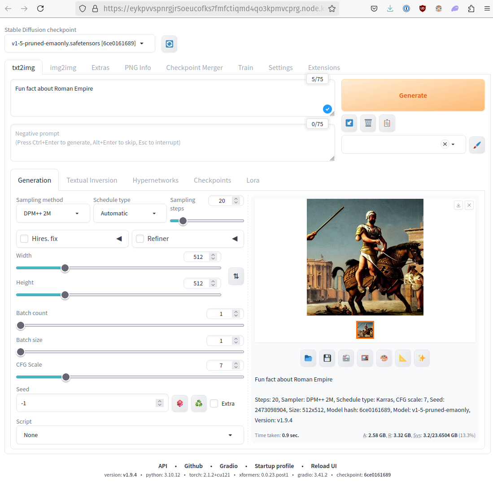

# Stable Diffusion WebUI


[Stable Diffusion WebUI](https://github.com/AUTOMATIC1111/stable-diffusion-webui) is a web interface for Stable Diffusion, implemented using Gradio library.

Unleash your creativity with Nosana! Effortlessly run a Stable Diffusion instance to generate stunning images.
Experience the power of advanced AI and GPU-backed nodes, making your image creation process smooth and efficient.
Whether for personal projects or professional work, Nosana provides the tools you need to bring your artistic visions to life.

## JSON Job Schema

::: info
Create a file named `stable-webui.json`, copy and paste the following into it:
:::

```json
{
  "version": "0.1",
  "type": "container",
  "meta": {
    "trigger": "cli"
  },
  "ops": [
    {
      "type": "container/run",
      "id": "stable-webui",
      "args": {
        "cmd": [],
        "image": "docker.io/universonic/stable-diffusion-webui:minimal",
        "gpu": true,
        "expose": 8080,
        "resources": [
          {
            "type": "S3",
            "url": "https://models.nosana.io/stable-diffusion/1.5",
            "target": "/app/stable-diffusion-webui/models/Stable-diffusion"
          }
        ]
      }
    }
  ]
}
```

## Command

Run the following command to post the job to the Nosana network.

```sh:no-line-numbers
nosana job post --file stable_webui.json --market nvidia-4090
```

## Output

```sh:no-line-numbers
  _   _
 | \ | | ___  ___  __ _ _ __   __ _
 |  \| |/ _ \/ __|/ _` | '_ \ / _` |
 | |\  | (_) \__ \ (_| | | | | (_| |
 |_| \_|\___/|___/\__,_|_| |_|\__,_|

Reading keypair from /home/djmbritt/.nosana/nosana_key.json

Network:	mainnet
Wallet:		4WtG17Vn3SSoTAVvXxpopQTG3Qo9NUK28Zotv4rL1ccv
SOL balance:	0.07779196 SOL
NOS balance:	72.163245 NOS
ipfs uploaded:	https://nosana.mypinata.cloud/ipfs/QmbYeFzM6gNCf32GqQG2GDYQsFXxhBWYPskHHzooQSURBW
posting job to market 97G9NnvBDQ2WpKu6fasoMsAKmfj63C9rhysJnkeWodAf for price 0.000097 NOS/s (total: 0.6984 NOS)
job posted with tx 3TveJgqzHiV1p97jxxzvS8Jeg29o7uKKtAJCU6NJ5SAtRsndtrkA6az3kLQwXp3aNatXD3ZUrBJ64YetWpTXsTFB!
Service will be exposed at https://GY1BDTVMQtwSJ7V3zFT5tYNimmyPRQfaJLKV1R5FDbz3.node.k8s.prd.nos.ci
Job:		https://explorer.nosana.io/jobs/5hYyrw4jBkekaLDZviAvoBJPXjfUgJu5S8u1fjzdt5Wx
JSON flow:	https://nosana.mypinata.cloud/ipfs/QmbYeFzM6gNCf32GqQG2GDYQsFXxhBWYPskHHzooQSURBW
Market:		https://explorer.nosana.io/markets/97G9NnvBDQ2WpKu6fasoMsAKmfj63C9rhysJnkeWodAf
Price:		0.000097 NOS/s
Status:		RUNNING

run nosana job get 5hYyrw4jBkekaLDZviAvoBJPXjfUgJu5S8u1fjzdt5Wx --network mainnet to retrieve job and result
```

## Example


