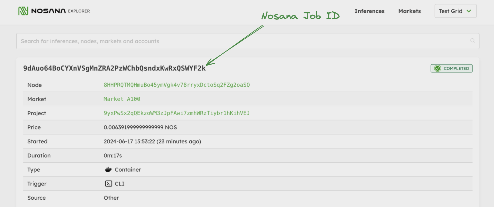

# Job Schema

The Nosana Job schema allows us to create a job definition and specify the parameters needed for our job. In this case, we will be posting a job to prompt a [TinyLlama](https://github.com/jzhang38/TinyLlama) instance to create a story about "Tony the tiny hawk." There are other features, such as specifying the running environment and triggers, but for now, we will only focus on the `ops.args` object of our schema definition.

## Define Job Schema

1. **Create a JSON file:**
   - Name the file `story.json` and add the following content to define a job schema for running an AI inference task using the [TinyLlama Model](https://github.com/jzhang38/TinyLlama).

2. **Explanation:**
   - We will explain the different fields in a job schema in the next part of our documentation. For now, focus on the `cmd` field in the `args` object, which contains the prompt: "Write me a story about Tony the tiny hawk." You can replace this with your own prompt, but remember to enclose it in single quotes `'...'`.

```json
{
  "version": "0.1",
  "type": "container",
  "meta": {
    "trigger": "cli"
  },
  "ops": [
    {
      "type": "container/run",
      "id": "tinyllama",
      "args": {
        "cmd": ["'Write me a story about Tony the tiny hawk'"],
        "image": "docker.io/jeisses/tinyllama:v4",
        "gpu": true
      }
    }
  ]
}
```

## Markets

Markets on Nosana are clustered based on specific NVIDIA GPU models, ranging from the 3060s and A40s to 4090s. You can see the different markets available at the following link: <https://dashboard.nosana.com/markets>

We will use the following market: [Link To Market](https://dashboard.nosana.com/markets/RXP7JK8MTY4uPJng4UjC9ZJdDDSG6wGr8pvVf3mwgXF). This market has compute with NVIDIA RTX 4090 GPUs, which are well-suited for a variety of AI applications, including AI inferencing. It may not be the cheapest market, but at the time of writing, it has the most GPUs. You can always choose another market that better accommodates your needs.

## Posting the Job

When you send a job to the Nosana network, you're essentially posting a job to a market. There is a Nosana Node with a NVIDIA GPU in queue for a specific market, and it will pick up new job postings.

Let's post our job to the Nosana network on the following NVIDIA 4090 market address: `EzuHhkrhmV98HWzREsgLenKj2iHdJgrKmzfL8psP8Aso`

```sh:no-line-numbers
nosana job post --file story.json --market RXP7JK8MTY4uPJng4UjC9ZJdDDSG6wGr8pvVf3mwgXF --wait
```

Alternatively it is also possible to post to a specific GPU market using it's slug, such as `nvidia-4090`.
Use the `nosana market list` command to take a look at the available slugs or take a look at [Markets](./markets.md#list-markets).

```sh:no-line-numbers
nosana job post --file story.json --market nvidia-4090  --wait
```

Now you should be able to see the job running on our network in the `Status` field.

```sh:no-line-numbers{21} Running
  _   _
 | \ | | ___  ___  __ _ _ __   __ _
 |  \| |/ _ \/ __|/ _` | '_ \ / _` |
 | |\  | (_) \__ \ (_| | | | | (_| |
 |_| \_|\___/|___/\__,_|_| |_|\__,_|

Reading keypair from /home/djmbritt/.nosana/nosana_key.json

Network:	mainnet
Wallet:		4WtG17Vn3SSoTAVvXxpopQTG3Qo9NUK28Zotv4rL1ccv
SOL balance:	0.04303304 SOL
NOS balance:	5.520211 NOS
ipfs uploaded:	https://nosana.mypinata.cloud/ipfs/QmVfCSRc7LmVUJQbJKJuvj9k61wsrDFUyfbv9pzntFoC1G
posting job to market CA5pMpqkYFKtme7K31pNB1s62X2SdhEv1nN9RdxKCpuQ for price 0.00009 NOS/s (total: 0.6480 NOS)
job posted with tx 3czE7QrbTnVPSWyAcuHDvj6TCLPG6xYNwWNab6Hs8PkW3RpNozhw8r1tLgNzSnNJJZeVBi3jVwHTFWgHW7Q8HSmw!
Service will be exposed at https://GTrY9X8AEHGHyCDS2py1sm4xQNUMkB5Zjy58sVYCTJ9t.node.k8s.prd.nos.ci
Job:		https://dashboard.nosana.com/jobs/3brMatsFV2uNaY9VDMKdC3jmpBvq1GQs1o9nvddQqKoQ
JSON flow:	https://nosana.mypinata.cloud/ipfs/QmVfCSRc7LmVUJQbJKJuvj9k61wsrDFUyfbv9pzntFoC1G
Market:		https://dashboard.nosana.com/markets/CA5pMpqkYFKtme7K31pNB1s62X2SdhEv1nN9RdxKCpuQ
Price:		0.00009 NOS/s
Status:		RUNNING
⠙ Waiting for job to complete
```

After a few seconds, you can see that the `Status` has changed to `COMPLETED` with the response to the prompt.

```sh:no-line-numbers Completed

-- Redacted

Node:		https://dashboard.nosana.com/nodes/7WcQdNdReaz2FMMRrthxrELjfGtXwbKZXuDZUoha2Eis
Start Time:	Thu Jul 18 2024 09:29:28 GMT-0400 (Atlantic Standard Time)
Duration:	12 seconds
Total Costs:	0.00108 NOS
Status:		COMPLETED
Result:		https://nosana.mypinata.cloud/ipfs/QmUpv6jQmMjiJKYaozcLZvUcujkiWg8L3RWkvmX42xdYL7
Logs:

- Executed step ollama in 4.965s
Tony the tiny hawk. He was a graceful bird. Every day, he would zip up the trees and make patterns with his wings. One day, Tony decided he wanted to learn more about history.
So, he visited the forest and found a graceful deer. He watched

 as the deer showed him the leaves and the trees. Tony was amazed by all the fascinating things he could do.
He knew that nature was in difficult places, but also full of inspiration. So, he started to explore the area around him and make new friends. He even started to dance, be singing, and visit the world.
achieved tok/s: 116.402116
The graceful deer and the mouse were his best friends and they had many fun times together. Tony was so happy he had learned something new. He would never forget the day he met his new friend.

Exited with status success with code 0
```

As mentioned before, you can retrieve the job and its potential results using the `nosana job get` command.



```sh:no-line-numbers
nosana job get INSERT_JOB_ID --network mainnet --wait
```

Now that we know how to write a basic Nosana job schema, we will continue with creating a long-running instance that we can query multiple times via an endpoint.

After that, we will go into more detail on how to write more complex jobs, adjust parameters of each job to accommodate your needs, provide a more in-depth explanation of Nosana's GPU markets, and explore the available models on Nosana for you to run inference on!

