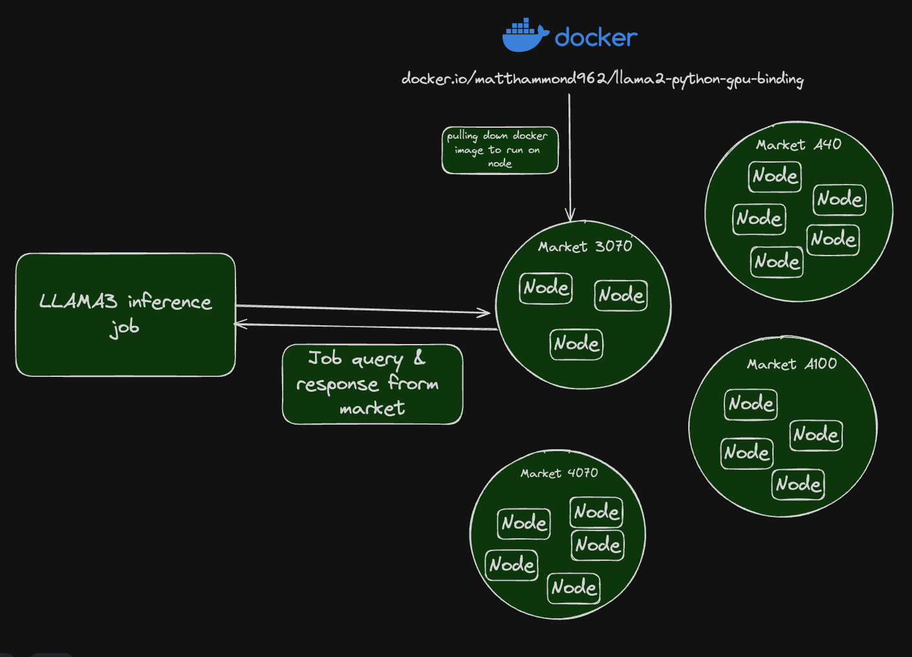

# How To Write A Job

## Overview

- **Nosana Jobs**: Each job on the Nosana network is essentially an AI inference task that runs from a Docker container. The jobs are designed to utilize GPU resources efficiently.
- **Nosana Nodes**: Jobs run on different Nosana nodes, which are represented as Solana addresses in the Nosana explorer. Each node contributes its GPU resources to execute the jobs.
- **GPU Markets**: Different types of GPUs available in the network are categorized into various markets. Each market supports specific job requirements based on the type of GPU.



## Execution Flow

These steps describe how submitting an inference job to the Nosana network.

1. **Job Submission**: A user submits a job defined in a JSON format. This job specifies the tasks to be executed, the Docker images to be used, and whether GPU resources are required.
2. **Node Selection**: The job is assigned to a Nosana node based on its requirements. The nodes are identified by their Solana addresses.
3. **Job Execution**: The selected node pulls the necessary Docker image and executes the commands specified in the job. For example, running AI inference tasks using the provided Python scripts.
4. **Resource Utilization**: Nodes utilize their GPU resources to run the tasks. This decentralized approach ensures efficient use of available hardware.
5. **Completion and Rewards**: Once the job is completed, the node may earn $NOS tokens as a reward for contributing its GPU resources.

## Examples

Nosana is a fully permissionless network, which means that whatever model you want to run in our network you can!
For examples you can take a look at the [Examples Catalog](../inference/examples/) or visit: [Nosana Templates](https://github.com/nosana-ci/pipeline-templates/tree/main/templates) on GitHub.
Some examples of which models you can run and links can be found in the following table:

### Nosana Inference example

You can explore the different jobs happening on the [Nosana Explorer](https://explorer.nosana.io/).
Here we can see an example of a Nosana inference job.
Note there are 2 `ops` (short for operations) happening in this inference job, both are using an [Ubuntu Docker Container](https://hub.docker.com/_/ubuntu).

1. The first one is using the [nvidia-smi](https://developer.nvidia.com/system-management-interface) and other utilities to log hardware specifications of the Nosana node.
2. The second element in the `ops` array is using [Whisper](https://github.com/openai/whisper) to transcribe an audio file.

The `cmd` array is where we can input shell commands, we can specify the Docker `image` used, environment variables can be set using the `env` map, the GPU can be enable by setting the `gpu` value to true.
Read below for a full list of all of the properties you can set.

```json
{
  "version": "0.1",
  "type": "container",
  "meta": {
    "trigger": "cli"
  },
  "ops": [
    {
      "type": "container/run",
      "id": "gpu-stats",
      "args": {
        "cmd": ["sh -c ", "nvidia-smi; cat /proc/cpuinfo | grep flags | head -1;"],
        "image": "ubuntu",
        "env": {
          "DEBUG": "1"
        },
        "gpu": true
      }
    },
    {
      "type": "container/run",
      "id": "run-whisper",
      "args": {
        "cmd": [
          "sh -c ",
          "wget -q https://nosana.mypinata.cloud/ipfs/QmPKP7hjBd1Yyt6CmVpggNCgn9x5oXD1ok27HQvmPiFyew -O audio.mp3;",
          "python openai-whisper.py -p audio.mp3;",
          "wget -q https://nosana.mypinata.cloud/ipfs/QmUFXcvn3KZNvQmND9SCtDnzsU4NzL6awwYTiCkTkdFNTd -O audio.mp3;",
          "python openai-whisper.py -p audio.mp3;"
          // additional commands omitted for brevity
        ],
        "image": "docker.io/nosana/whisper:cuda-check",
        "gpu": true
      }
    }
  ]
}
```

## Job Schema Specification

Below we can see a list of the properties and a description for each property that can be set in a Nosana Jofor each property that can be set in a Nosana Job.

- **`version`**: Specifies Nosana compiler version.
- **`type`**: Indicates the type of job. Here, it's set to "container", meaning the job will run inside a Docker container.
- **`meta` (optional)**:
  - **`trigger`**: Defines how the job is triggered. In this example, it's set to "cli" (command-line interface).
- **`global` (optional)**: This a is a property to help define the properties of all of the operations defined in `ops`.

  - **`image`**: The Docker image to be used for the container.
  - **`gpu`**: A boolean indicating whether GPU resources are required.
  - **`entrypoint`**: An entry point in a container is a script or executable that specifies the command to be run when the container starts
  - **`env`**: Key value map for environment variables in the container.
  - **`work_dir`**: The working directory that will be selected for running commands.

- **`ops`**: An array of operations that the job will perform. Each operation includes:
  - **`type`**: Specifies the operation type. For instance, "container/run" indicates a containerized operation.
  - **`id`**: A unique identifier for the operation. Examples include "gpu-stats" and "run-whisper".
  - **`results`**(optional): - **`regex`**: Regex for parsing the result. - **`logType`**: The type of log for the result.
  - **`args`**: Arguments for the operation, which include:
    - **`image`**: The Docker image to be used for the container.
    - **`cmd`**: The command(s) to be executed in the container.
    - **`volumes` (optional)**: An array of objects containing a `name` and `dest` (destination) properties.
    - **`expose` (optional)**: A number representing an application port that needs to be exposed via the Nosana Service Endpoint.
    - **`gpu` (optional)**: A boolean indicating whether GPU resources are required.
    - **`work_dir` (optional)**: The working directory that will be selected for running commands.
    - **`output` (optional)**: Specify the output
    - **`entrypoint` (optional)**: An entry point in a container is a script or executable that specifies the command to be run when the container starts
    - **`env` (optional)**: Key value map for environment variables in the container.
    - **`resources` (optional)**: An array containing assets needed for inference.
      - **`type`**: String representing where the asset should be retrieved from, S3, HF (HuggingFace) or IPFS.
      - **`url`**: URL representing where the asset is located.
      - **`target`**: Location where the asset should be downloaded to.

### `cmd`

The `cmd` array is important to illustrate, because there are some nuances on how to use it.
If you are familiar with how to use the `cmd` property in Docker, you should already have an idea of how this property works.

There are two primary ways of using the `cmd` array.

1. String based CMD
2. Array based CMD

### String based CMD

When the first element of the array is the whole command, such as:
`"gunicorn -w 4 -k uvicorn.workers.UvicornWorker main:app"`
Bash will be used as the shell to interpret this command.

### Array based CMD

Another option is to put each command and every flag as it's own element in an array:
`["/bin/sh", "-c", gunicorn", "-w", "4", "-k", "uvicorn.workers.UvicornWorker", "main:app"]`

With the array based notation, we are able to specify the shell we want to use.
Note that most often you will need to append `-c` flag after `/bin/sh`

You can read more about how to use the `cmd` property by going to the [Docker Documentation](https://docs.docker.com/reference/dockerfile/#cmd).

### Job JSON schema

Here you will be able to see the full JSON schema specification for a Nosana Job.

```json
{
  "$schema": "http://json-schema.org/draft-07/schema#",
  "definitions": {
    "JobType": {
      "type": "string",
      "enum": ["container"]
    },
    "OperationType": {
      "type": "string",
      "enum": ["container/run", "container/create-volume"]
    },
    "OperationArgsMap": {
      "type": "object",
      "properties": {
        "container/run": {
          "type": "object",
          "properties": {
            "image": { "type": "string" },
            "cmd": {
              "oneOf": [
                { "type": "string" },
                {
                  "type": "array",
                  "items": { "type": "string" }
                }
              ]
            },
            "volumes": {
              "type": "array",
              "items": {
                "type": "object",
                "properties": {
                  "name": { "type": "string" },
                  "dest": { "type": "string" }
                },
                "required": ["name", "dest"]
              }
            },
            "expose": { "type": "number" },
            "gpu": { "type": "boolean" },
            "work_dir": { "type": "string" },
            "output": { "type": "string" },
            "entrypoint": {
              "oneOf": [
                { "type": "string" },
                {
                  "type": "array",
                  "items": { "type": "string" }
                }
              ]
            },
            "env": {
              "type": "object",
              "additionalProperties": { "type": "string" }
            },
            "resources": {
              "type": "array",
              "items": {
                "type": "object",
                "properties": {
                  "type": { "type": "string" },
                  "url": { "type": "string" }
                  "target": { "type": "string" }
                },
                "required": ["type", "url", "target"]
              }
            },
          },
          "required": ["image", "cmd"]
        },
        "container/create-volume": {
          "type": "object",
          "properties": {
            "name": { "type": "string" }
          },
          "required": ["name"]
        }
      }
    },
    "OperationResults": {
      "type": "object"
    },
    "Operation": {
      "type": "object",
      "properties": {
        "type": { "$ref": "#/definitions/OperationType" },
        "id": { "type": "string" },
        "args": { "type": "object" },
        "results": { "$ref": "#/definitions/OperationResults" }
      },
      "required": ["type", "id", "args"]
    }
  },
  "type": "object",
  "properties": {
    "version": { "type": "string" },
    "type": { "$ref": "#/definitions/JobType" },
    "meta": {
      "type": "object",
      "properties": {
        "trigger": { "type": "string" }
      }
    },
    "global": {
      "type": "object",
      "properties": {
        "image": { "type": "string" },
        "gpu": { "type": "boolean" },
        "entrypoint": {
          "oneOf": [
            { "type": "string" },
            {
              "type": "array",
              "items": { "type": "string" }
            }
          ]
        },
        "env": {
          "type": "object",
          "additionalProperties": { "type": "string" }
        },
        "work_dir": { "type": "string" }
      }
    },
    "ops": {
      "type": "array",
      "items": { "$ref": "#/definitions/Operation" }
    }
  },
  "required": ["version", "type", "ops"]
}
```
