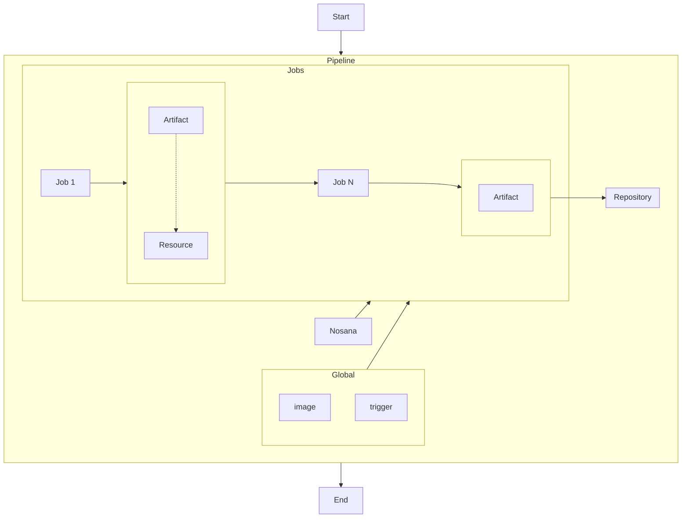

# Introduction

Here at Nosana we believe in a decentralized future, where computation can be provided by everyone instead of a few cloud providers.

Nosana gives developers the tooling and resources to create their CI/CD pipelines and have their communities run them for them.
Nosana CI/CD pipelines are built on top of the Solana blockchain, and are powered by the Nosana Network.
You can use Nosana CI/CD pipelines to test, build, and deploy your code.

## What is CI/CD?

CI/CD stands for Continuous Integration and Continuous Delivery. Today it also stands for Continuous Deployment. It is a set of practices that allow you to continuously test, build, and deploy your code.

Software developers live and breath version control systems like Git. They use them to track changes to their code, and to collaborate with their team members.
This led to the first practice of CI/CD: Continuous Integration. Continuous Integration is the practice of integrating code changes into a shared repository as often as possible.
This allows developers to catch bugs early, and to collaborate more efficiently.

The second practice of CI/CD is Continuous Delivery. Continuous Delivery is the practice of automatically building and deploying your code to a staging environment.
This allows you to test your code in a production-like environment, and catch bugs before they reach your users.

As mentioned before it also means Continuous Deployment. Continuous Deployment is the practice of automatically deploying your code to production.
This allows you to deploy your code as soon as it is ready, and to deliver value to your users as soon as possible.
But at Nosana we believe that Continuous Deployment is not for everyone. We believe that you should be in control of how and when your code is deployed to production.
In other words, Continuous Deployment will not be part of this discussion.

---

This guide will walk you through the process of getting started with Nosana CI/CD pipelines.
You will learn how to use Nosana to create a simple pipeline that builds and deploys the documentation for this [site](https://docs.nosana.io).

Along the way we will be exploring the core concepts of Nosana CI/CD pipelines, including:

## Pipelines

What's a pipeline? A pipeline is a set of tasks that are executed to build, test and deploy your application.
This is done within controlled environments called containers that are loaded in from images.
All of the tasks that are executed in the container are defined in a file called `.nosana-ci.yml`.
Code goes into the pipeline afterward test results, build artifacts, and other data will come out of the pipeline.

## Images

What's an image? An image is a template for a container. It contains all the tools and dependencies that are needed to run your pipeline.
Images help you build replicable environments that are isolated from the rest of the system and are easy to share with your team.

Need to run your pipeline on a specific version of Node? No problem, just pull an image with that version of Node installed.
Need to build your mobile application for Android? No problem, just pull an image with the Android SDK installed.
Want to build your Rust application? No problem, just pull an image with Rust installed.

All of the images that you are used to using, like [`node:12`](https://hub.docker.com/_/node), [`golang:1.14`](https://hub.docker.com/_/golang) and [`rust:1.42`](https://hub.docker.com/_/rust) are available on public container registries and can be pulled into the Nosana Network. Nosana Nodes are designed to run the workloads of these images within containers.

### Private images

Sometimes you want to use an image that is privately hosted, and you need to access it by authenticating yourself.
This is now also possible. You can pass in your credentials with your image to run your pipeline on your private images.
You can read more about it [here](./start.md) on how to get started.

## Containers

What's a container? A container is an instance of an image.
It is a running process that is isolated from the rest of the system.
Containers are built from images and are used to create a replicable, isolated environment to run your pipeline.
Back in the day, you would need to spin up a virtual machine. Which is resource intensive and slow.
Today you can build a container in seconds, and it is much more lightweight than a virtual machine.
The container can be quickly built with the specific tools and dependencies that are needed to run your pipeline.
So you'll never have to worry again about your build environment being different from your production environment.

## Jobs

What's a job? A job is a set of CLI commands that are executed in sequence for each step of your test, build and deploy process.
Jobs are defined in a file called `.nosana-ci.yml` and are executed in a container.
Jobs are the building blocks of your pipeline.

One of the most important things to know about jobs is that they are executed in sequence. This means that the output of one job is the input of the next job.
This is how you can pass data from one job to the next.
For example, you can use the output of one job, like the installation of a dependency, as the input of the next job, the build of your application.
The output of the build job can then be used as the input of the next job, the deployment of your application.

## Diagram

Here is a simple representation of the diagram that we can use to describe a pipeline:

## Next Steps

Now that we have some of the basic terminologies down, let's move on to creating our first pipeline.
