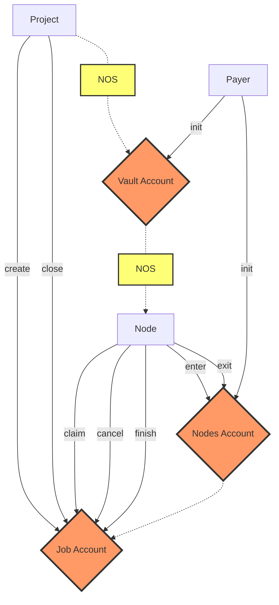

# Nosana Jobs <Badge type="tip" text="mainnet" vertical="middle" />

The Nosana Jobs program allows projects to post pipeline jobs.
It allows nodes in the Nosana Network to earn tokens by running those jobs.

## Program Information

| Info            | Description                                                                                                                      |
|-----------------|----------------------------------------------------------------------------------------------------------------------------------|
| Type            | [Solana Program](https://docs.solana.com/developing/programming-model/overview)                                                  |
| Source Code     | [GitHub](https://github.com/nosana-ci/nosana-programs)                                                                           |
| Accounts        | `3`                                                                                                                              |
| Instructions    | `8`                                                                                                                              |
| Domain          | `nosana-jobs.sol`                                                                                                                |
| Program Address | [`nosJhNRqr2bc9g1nfGDcXXTXvYUmxD4cVwy2pMWhrYM`](https://explorer.solana.com/address/nosJhNRqr2bc9g1nfGDcXXTXvYUmxD4cVwy2pMWhrYM) |
| APR             | [✅](https://www.apr.dev/program/nosJhNRqr2bc9g1nfGDcXXTXvYUmxD4cVwy2pMWhrYM)                                                     |

## Diagram



## Accounts

A number of 3 account types make for the Nosana Job programs' state.

### Vault Account

The `VaultAccount` is regular Solana Token Account.

### Nodes Account

The `NodesAccount` struct holds all the information about jobs and the nodes queue.

```rust
pub struct NodesAccount {
    pub job_price: u64,
    pub job_timeout: i64,
    pub job_type: u8,
    pub vault: Pubkey,
    pub vault_bump: u8,
    pub queue: Vec<Pubkey>,
}
```

### Job Account

The `JobAccount` struct holds all the information about any invidual jobs.

```rust
pub struct JobAccount {
    pub authority: Pubkey,
    pub ipfs_job: [u8; 32],
    pub ipfs_result: [u8; 32],
    pub node: Pubkey,
    pub nodes: Pubkey,
    pub status: u8,
    pub time_start: i64,
    pub time_end: i64,
}
```

## Instructions

A number of 8 instruction are defined in the Nosana Staking program.
To load the program with [Anchor](https://coral-xyz.github.io/anchor/ts/index.html) in `TypeScript`:

```typescript
const programId = new PublicKey('nosJhNRqr2bc9g1nfGDcXXTXvYUmxD4cVwy2pMWhrYM');
const idl = await Program.fetchIdl(programId.toString());
const program = new Program(idl, programId);
```

### Init

The `init()` instruction initializes a nodes queue and a associated token vault for token deposits.

```typescript
let tx = await program.methods
  .init(
    jobPrice,
    jobTimeout,
    jobType,
  )
  .accounts({
    mint,
    nodes,
    vault,
    authority,
    rent,
    systemProgram,
    tokenProgram,
  })
  .signers([authorityKey])
  .rpc();
```

### Create

The `create()` instruction creates a Job with it's required data.
When there is a node ready in the queue it will immediately start running.

```typescript
let tx = await program.methods
  .init(ipfsJob)
  .accounts({
    job,
    nodes,
    vault,
    user,
    authority,
    rent,
    systemProgram,
    tokenProgram,
  })
  .signers([authorityKey])
  .rpc();
```

### Close

The `close()` instruction closes an existing job account.
When the job was still queued the tokens will be returned to the user.

```typescript
let tx = await program.methods
  .close()
  .accounts({
    job,
    nodes,
    vault,
    user,
    authority,
    tokenProgram,
  })
  .signers([authorityKey])
  .rpc();
```

### Enter

With the `enter()` instruction a node enters the node queue.

A few requirements are enforced:

- A node needs to have a minimum stake in Nosana Staking.
- A node needs to hold an official Nosana NFT.
- A node can only enter the queue once

```typescript
let tx = await program.methods
  .enter()
  .accounts({
    stake,
    nft,
    metadata,
    nodes,
    vault,
    authority,
  })
  .signers([authorityKey])
  .rpc();
```

### Exit

With the `exit()` instruction a node exits the node queue.

```typescript
let tx = await program.methods
  .exit()
  .accounts({
    nodes,
    authority,
  })
  .signers([authorityKey])
  .rpc();
```

### Claim

With the `claim()` instruction a node can claim a job that is:

- In the Queued (`0`) state.
- In the Running (`1`) state, but after is has expired.

```typescript
let tx = await program.methods
  .claim()
  .accounts({
    job,
    stake,
    nft,
    metadata,
    nodes,
    vault,
    authority,
  })
  .signers([authorityKey])
  .rpc();
```

To find unclaimed jobs with anchor:

```typescript
const jobs = await program.account.jobAccount.all([
  {
    memcmp: {
      offset: 8 + 32 * 3, // the assigned node must be NULL
      bytes: systemProgram.toBase58(),
    },
  },
  {
    memcmp: {
      offset: 8 + 32 * 4, // the nodes queue
      bytes: nodes.toBase58(),
    },
  },
  {
    memcmp: {
      offset: 8 + 32 * 5, // the job status
      bytes: '1',
    },
  },
]);
```

Note: leave the `nodes` out to find jobs across all node queues.

To find jobs that have timed out, we first find all running jobs.

```typescript
const jobs = await program.account.jobAccount.all([
  {
    memcmp: {
      offset: 8 + 32 * 4, // the nodes queue
      bytes: nodes.toBase58(),
    },
  },
  {
    memcmp: {
      offset: 8 + 32 * 5, // the job status
      bytes: '2',
    },
  },
]);
```

With the retrieved running `jobs` we can find jobs that have expired,
by checking their start time:

```typescript
for (const job of jobs) {
  if (job.account.timeStart > (Date.now() / 1e3 - nodes.jobTimout)) {
    // claim job!
  }
}
```

### Cancel

With the `cancel()` instruction a node can stop running a job that it has started.

```typescript
let tx = await program.methods
  .cancel()
  .accounts({
    job,
    authority,
  })
  .signers([authorityKey])
  .rpc();
```

### Finish

With the `finish()` instruction a node can can post the result for a job it has finished, and me reimbursed for the work.

```typescript
let tx = await program.methods
  .finish()
  .accounts({
    job,
    nodes,
    vault,
    user,
    authority,
    tokenProgram,
  })
  .signers([authorityKey])
  .rpc();
```
