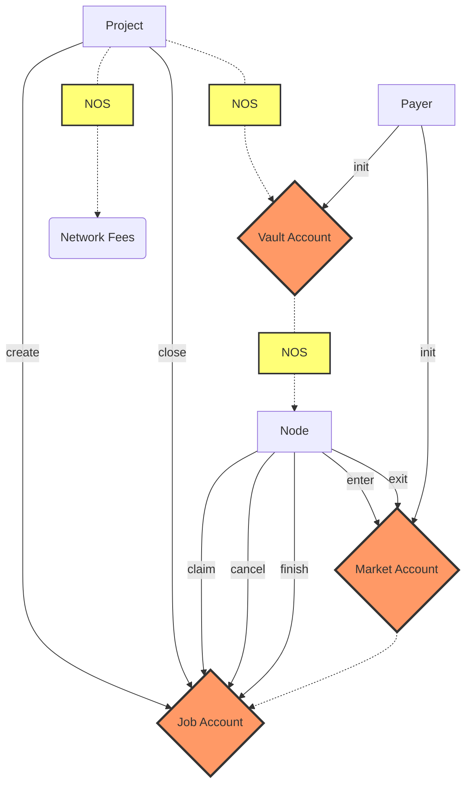

# Nosana Jobs

Projects can post pipeline jobs through the Nosana Jobs program.
It lets nodes in the Nosana Network earn tokens by doing those jobs.

<!-- BEGIN_NOS_DOCS -->

## Program Information

| Info            | Description                                                                                                                         |
|-----------------|-------------------------------------------------------------------------------------------------------------------------------------|
| Type            | [Solana Program](https://docs.solana.com/developing/intro/programs#on-chain-programs)                                               |
| Source Code     | [GitHub](https://github.com/nosana-ci/nosana-programs)                                                                              |
| Build Status    | [Anchor Verified](https://www.apr.dev/program/nosJhNRqr2bc9g1nfGDcXXTXvYUmxD4cVwy2pMWhrYM)                                          |
| Accounts        | [`3`](#accounts)                                                                                                                    |
| Instructions    | [`10`](#instructions)                                                                                                               |
| Types           | [`2`](#types)                                                                                                                       |
| Domain          | `nosana-jobs.sol`                                                                                                                   |
|  Address        | [`nosJhNRqr2bc9g1nfGDcXXTXvYUmxD4cVwy2pMWhrYM`](https://explorer.solana.com/address/nosJhNRqr2bc9g1nfGDcXXTXvYUmxD4cVwy2pMWhrYM)    |

## Instructions

A number of 10 instruction are defined in the Nosana Jobs program.

::: details Example

To load the program with [Anchor](https://coral-xyz.github.io/anchor/ts/index.html).

```typescript
const programId = new PublicKey('nosJhNRqr2bc9g1nfGDcXXTXvYUmxD4cVwy2pMWhrYM');
const idl = await Program.fetchIdl(programId.toString());
const program = new Program(idl, programId);
```

:::: tabs
@tab Init
### Init

The `init()` instruction initializes a [MarketAccount](#market-account) and an
associated [VaultAccount](#vault-account) for token deposits.

#### Accounts

| Name                   | Type                                                                                    | Description                                                                                       |
|------------------------|-----------------------------------------------------------------------------------------|---------------------------------------------------------------------------------------------------|
| `mint`                 | <FontIcon icon="pencil" color="lightgrey" /><FontIcon icon="key" color="lightgrey" />   | The token Mint address for this instruction.                                                      |
| `market`               | <FontIcon icon="pencil" color="#3EAF7C" /><FontIcon icon="key" color="#3EAF7C" />       | The [MarketAccount](#market-account) address.                                                     |
| `vault`                | <FontIcon icon="pencil" color="#3EAF7C" /><FontIcon icon="key" color="lightgrey" />     | The [VaultAccount](#vault-account) address.                                                       |
| `authority`            | <FontIcon icon="pencil" color="#3EAF7C" /><FontIcon icon="key" color="#3EAF7C" />       | The signing authority of the program invocation.                                                  |
| `accessKey`            | <FontIcon icon="pencil" color="lightgrey" /><FontIcon icon="key" color="lightgrey" />   | The Node Access Key address.                                                                      |
| `rent`                 | <FontIcon icon="pencil" color="lightgrey" /><FontIcon icon="key" color="lightgrey" />   | The official Solana rent address. Responsible for lamports.                                       |
| `systemProgram`        | <FontIcon icon="pencil" color="lightgrey" /><FontIcon icon="key" color="lightgrey" />   | The official Solana system program address. Responsible for system CPIs.                          |
| `tokenProgram`         | <FontIcon icon="pencil" color="lightgrey" /><FontIcon icon="key" color="lightgrey" />   | The official SPL Token Program address. Responsible for token CPIs.                               |

#### Arguments

| Name                   | Type              | Size    | Offset  | Description                                               |
|------------------------|-------------------|---------|---------|-----------------------------------------------------------|
| `jobPrice`             | `u64`             | `8`     | `0`     | The price for jobs in this market.                        |
| `jobTimeout`           | `i64`             | `16`    | `8`     | The timeout time in seconds for jobs.                     |
| `jobType`              | `u8`              | `1`     | `24`    | The [JobType](#job-type) number.                          |
| `nodeStakeMinimum`     | `u64`             | `8`     | `25`    | The number of tokens a node needs to stake to qualify.    |

::: details Example

To run the instructions with [Anchor](https://coral-xyz.github.io/anchor/ts/index.html).

```typescript
let tx = await program.methods
  .init(
    jobPrice,          // type: u64
    jobTimeout,        // type: i64
    jobType,           // type: u8
    nodeStakeMinimum,  // type: u64
  )
  .accounts({
    mint,              // 𐄂 writable, 𐄂 signer
    market,            // ✓ writable, ✓ signer
    vault,             // ✓ writable, 𐄂 signer
    authority,         // ✓ writable, ✓ signer
    accessKey,         // 𐄂 writable, 𐄂 signer
    rent,              // 𐄂 writable, 𐄂 signer
    systemProgram,     // 𐄂 writable, 𐄂 signer
    tokenProgram,      // 𐄂 writable, 𐄂 signer
  })
  .signers([marketKey, authorityKey])
  .rpc();
```

@tab Stop
### Stop

The `stop()` instruction closes a [MarketAccount](#market-account) and an
associated [VaultAccount](#vault-account).
The vault has to be empty of tokens.

#### Accounts

| Name                   | Type                                                                                    | Description                                                                                       |
|------------------------|-----------------------------------------------------------------------------------------|---------------------------------------------------------------------------------------------------|
| `market`               | <FontIcon icon="pencil" color="#3EAF7C" /><FontIcon icon="key" color="lightgrey" />     | The [MarketAccount](#market-account) address.                                                     |
| `vault`                | <FontIcon icon="pencil" color="lightgrey" /><FontIcon icon="key" color="lightgrey" />   | The [VaultAccount](#vault-account) address.                                                       |
| `authority`            | <FontIcon icon="pencil" color="lightgrey" /><FontIcon icon="key" color="#3EAF7C" />     | The signing authority of the program invocation.                                                  |
| `tokenProgram`         | <FontIcon icon="pencil" color="lightgrey" /><FontIcon icon="key" color="lightgrey" />   | The official SPL Token Program address. Responsible for token CPIs.                               |

::: details Example

To run the instructions with [Anchor](https://coral-xyz.github.io/anchor/ts/index.html).

```typescript
let tx = await program.methods
  .stop()
  .accounts({
    market,            // ✓ writable, 𐄂 signer
    vault,             // 𐄂 writable, 𐄂 signer
    authority,         // 𐄂 writable, ✓ signer
    tokenProgram,      // 𐄂 writable, 𐄂 signer
  })
  .signers([authorityKey])
  .rpc();
```

@tab Update
### Update

The `update()` instruction update a [MarketAccount](#market-account).

#### Accounts

| Name                   | Type                                                                                    | Description                                                                                       |
|------------------------|-----------------------------------------------------------------------------------------|---------------------------------------------------------------------------------------------------|
| `market`               | <FontIcon icon="pencil" color="#3EAF7C" /><FontIcon icon="key" color="lightgrey" />     | The [MarketAccount](#market-account) address.                                                     |
| `accessKey`            | <FontIcon icon="pencil" color="lightgrey" /><FontIcon icon="key" color="lightgrey" />   | The Node Access Key address.                                                                      |
| `authority`            | <FontIcon icon="pencil" color="lightgrey" /><FontIcon icon="key" color="#3EAF7C" />     | The signing authority of the program invocation.                                                  |

#### Arguments

| Name                   | Type              | Size    | Offset  | Description                                               |
|------------------------|-------------------|---------|---------|-----------------------------------------------------------|
| `jobPrice`             | `u64`             | `8`     | `0`     | The price for jobs in this market.                        |
| `jobTimeout`           | `i64`             | `16`    | `8`     | The timeout time in seconds for jobs.                     |
| `jobType`              | `u8`              | `1`     | `24`    | The [JobType](#job-type) number.                          |
| `nodeStakeMinimum`     | `u64`             | `8`     | `25`    | The number of tokens a node needs to stake to qualify.    |

::: details Example

To run the instructions with [Anchor](https://coral-xyz.github.io/anchor/ts/index.html).

```typescript
let tx = await program.methods
  .update(
    jobPrice,          // type: u64
    jobTimeout,        // type: i64
    jobType,           // type: u8
    nodeStakeMinimum,  // type: u64
  )
  .accounts({
    market,            // ✓ writable, 𐄂 signer
    accessKey,         // 𐄂 writable, 𐄂 signer
    authority,         // 𐄂 writable, ✓ signer
  })
  .signers([authorityKey])
  .rpc();
```

@tab Create
### Create

The `create()` instruction creates a [JobAccount](#job-account) with its required data.
When there is a node ready in the queue it will immediately start running.

#### Accounts

| Name                   | Type                                                                                    | Description                                                                                       |
|------------------------|-----------------------------------------------------------------------------------------|---------------------------------------------------------------------------------------------------|
| `job`                  | <FontIcon icon="pencil" color="#3EAF7C" /><FontIcon icon="key" color="#3EAF7C" />       | The [JobAccount](#job-account) address.                                                           |
| `market`               | <FontIcon icon="pencil" color="#3EAF7C" /><FontIcon icon="key" color="lightgrey" />     | The [MarketAccount](#market-account) address.                                                     |
| `vault`                | <FontIcon icon="pencil" color="#3EAF7C" /><FontIcon icon="key" color="lightgrey" />     | The [VaultAccount](#vault-account) address.                                                       |
| `user`                 | <FontIcon icon="pencil" color="#3EAF7C" /><FontIcon icon="key" color="lightgrey" />     | The user token account that will debit/credit the tokens.                                         |
| `feePayer`             | <FontIcon icon="pencil" color="#3EAF7C" /><FontIcon icon="key" color="#3EAF7C" />       | The signing Fee Payer address.                                                                    |
| `authority`            | <FontIcon icon="pencil" color="lightgrey" /><FontIcon icon="key" color="#3EAF7C" />     | The signing authority of the program invocation.                                                  |
| `rewardsReflection`    | <FontIcon icon="pencil" color="#3EAF7C" /><FontIcon icon="key" color="lightgrey" />     | The Nosana Rewards Program's [ReflectionAccount](/programs/rewards#reflection-account) address.   |
| `rewardsVault`         | <FontIcon icon="pencil" color="#3EAF7C" /><FontIcon icon="key" color="lightgrey" />     | The Nosana Rewards Program's [VaultAccount](/programs/rewards#vault-account) address.             |
| `rewardsProgram`       | <FontIcon icon="pencil" color="lightgrey" /><FontIcon icon="key" color="lightgrey" />   | The [Nosana Rewards](/programs/rewards) Program address.                                          |
| `tokenProgram`         | <FontIcon icon="pencil" color="lightgrey" /><FontIcon icon="key" color="lightgrey" />   | The official SPL Token Program address. Responsible for token CPIs.                               |
| `systemProgram`        | <FontIcon icon="pencil" color="lightgrey" /><FontIcon icon="key" color="lightgrey" />   | The official Solana system program address. Responsible for system CPIs.                          |

#### Arguments

| Name                   | Type              | Size    | Offset  | Description                                               |
|------------------------|-------------------|---------|---------|-----------------------------------------------------------|
| `ipfsJob`              | `[u8; 32]`        | `32`    | `0`     | The byte array representing the IPFS hash to the job.     |

::: details Example

To run the instructions with [Anchor](https://coral-xyz.github.io/anchor/ts/index.html).

```typescript
let tx = await program.methods
  .create(
    ipfsJob,           // type: [u8; 32]
  )
  .accounts({
    job,               // ✓ writable, ✓ signer
    market,            // ✓ writable, 𐄂 signer
    vault,             // ✓ writable, 𐄂 signer
    user,              // ✓ writable, 𐄂 signer
    feePayer,          // ✓ writable, ✓ signer
    authority,         // 𐄂 writable, ✓ signer
    rewardsReflection, // ✓ writable, 𐄂 signer
    rewardsVault,      // ✓ writable, 𐄂 signer
    rewardsProgram,    // 𐄂 writable, 𐄂 signer
    tokenProgram,      // 𐄂 writable, 𐄂 signer
    systemProgram,     // 𐄂 writable, 𐄂 signer
  })
  .signers([jobKey, feePayerKey, authorityKey])
  .rpc();
```

@tab Close
### Close

The `close()` instruction closes an existing [JobAccount](#job-account).
When the job was still queued the tokens will be returned to the user.

#### Accounts

| Name                   | Type                                                                                    | Description                                                                                       |
|------------------------|-----------------------------------------------------------------------------------------|---------------------------------------------------------------------------------------------------|
| `job`                  | <FontIcon icon="pencil" color="#3EAF7C" /><FontIcon icon="key" color="lightgrey" />     | The [JobAccount](#job-account) address.                                                           |
| `market`               | <FontIcon icon="pencil" color="lightgrey" /><FontIcon icon="key" color="lightgrey" />   | The [MarketAccount](#market-account) address.                                                     |
| `vault`                | <FontIcon icon="pencil" color="#3EAF7C" /><FontIcon icon="key" color="lightgrey" />     | The [VaultAccount](#vault-account) address.                                                       |
| `user`                 | <FontIcon icon="pencil" color="#3EAF7C" /><FontIcon icon="key" color="lightgrey" />     | The user token account that will debit/credit the tokens.                                         |
| `authority`            | <FontIcon icon="pencil" color="lightgrey" /><FontIcon icon="key" color="#3EAF7C" />     | The signing authority of the program invocation.                                                  |
| `tokenProgram`         | <FontIcon icon="pencil" color="lightgrey" /><FontIcon icon="key" color="lightgrey" />   | The official SPL Token Program address. Responsible for token CPIs.                               |

::: details Example

To run the instructions with [Anchor](https://coral-xyz.github.io/anchor/ts/index.html).

```typescript
let tx = await program.methods
  .close()
  .accounts({
    job,               // ✓ writable, 𐄂 signer
    market,            // 𐄂 writable, 𐄂 signer
    vault,             // ✓ writable, 𐄂 signer
    user,              // ✓ writable, 𐄂 signer
    authority,         // 𐄂 writable, ✓ signer
    tokenProgram,      // 𐄂 writable, 𐄂 signer
  })
  .signers([authorityKey])
  .rpc();
```

@tab Cancel
### Cancel

With the `cancel()` instruction a node can stop running a job that it has started.

#### Accounts

| Name                   | Type                                                                                    | Description                                                                                       |
|------------------------|-----------------------------------------------------------------------------------------|---------------------------------------------------------------------------------------------------|
| `job`                  | <FontIcon icon="pencil" color="#3EAF7C" /><FontIcon icon="key" color="lightgrey" />     | The [JobAccount](#job-account) address.                                                           |
| `authority`            | <FontIcon icon="pencil" color="lightgrey" /><FontIcon icon="key" color="#3EAF7C" />     | The signing authority of the program invocation.                                                  |

::: details Example

To run the instructions with [Anchor](https://coral-xyz.github.io/anchor/ts/index.html).

```typescript
let tx = await program.methods
  .cancel()
  .accounts({
    job,               // ✓ writable, 𐄂 signer
    authority,         // 𐄂 writable, ✓ signer
  })
  .signers([authorityKey])
  .rpc();
```

@tab Claim
### Claim

With the claim() instruction a node can claim a job that is:

- In the Queued (`0`) state.
- In the Running (`1`) state, but after is has expired.

#### Accounts

| Name                   | Type                                                                                    | Description                                                                                       |
|------------------------|-----------------------------------------------------------------------------------------|---------------------------------------------------------------------------------------------------|
| `job`                  | <FontIcon icon="pencil" color="#3EAF7C" /><FontIcon icon="key" color="lightgrey" />     | The [JobAccount](#job-account) address.                                                           |
| `market`               | <FontIcon icon="pencil" color="#3EAF7C" /><FontIcon icon="key" color="lightgrey" />     | The [MarketAccount](#market-account) address.                                                     |
| `vault`                | <FontIcon icon="pencil" color="#3EAF7C" /><FontIcon icon="key" color="lightgrey" />     | The [VaultAccount](#vault-account) address.                                                       |
| `stake`                | <FontIcon icon="pencil" color="lightgrey" /><FontIcon icon="key" color="lightgrey" />   | The [StakeAccount](/programs/staking#stake-account) address.                                      |
| `nft`                  | <FontIcon icon="pencil" color="lightgrey" /><FontIcon icon="key" color="lightgrey" />   | The Token Account address that holds the NFT.                                                     |
| `metadata`             | <FontIcon icon="pencil" color="lightgrey" /><FontIcon icon="key" color="lightgrey" />   | The Metaplex Metadata address, that belongs to the NFT.                                           |
| `authority`            | <FontIcon icon="pencil" color="lightgrey" /><FontIcon icon="key" color="#3EAF7C" />     | The signing authority of the program invocation.                                                  |

::: details Example

To run the instructions with [Anchor](https://coral-xyz.github.io/anchor/ts/index.html).

```typescript
let tx = await program.methods
  .claim()
  .accounts({
    job,               // ✓ writable, 𐄂 signer
    market,            // ✓ writable, 𐄂 signer
    vault,             // ✓ writable, 𐄂 signer
    stake,             // 𐄂 writable, 𐄂 signer
    nft,               // 𐄂 writable, 𐄂 signer
    metadata,          // 𐄂 writable, 𐄂 signer
    authority,         // 𐄂 writable, ✓ signer
  })
  .signers([authorityKey])
  .rpc();
```

@tab Enter
### Enter

With the `enter()` instruction a node enters the [MarketAccount](#market-account) queue.

A few requirements are enforced:

- A node needs to have a minimum stake in Nosana Staking.
- A node needs to hold an official Nosana NFT.
- A node can only enter the queue once

#### Accounts

| Name                   | Type                                                                                    | Description                                                                                       |
|------------------------|-----------------------------------------------------------------------------------------|---------------------------------------------------------------------------------------------------|
| `authority`            | <FontIcon icon="pencil" color="lightgrey" /><FontIcon icon="key" color="#3EAF7C" />     | The signing authority of the program invocation.                                                  |
| `market`               | <FontIcon icon="pencil" color="#3EAF7C" /><FontIcon icon="key" color="lightgrey" />     | The [MarketAccount](#market-account) address.                                                     |
| `vault`                | <FontIcon icon="pencil" color="#3EAF7C" /><FontIcon icon="key" color="lightgrey" />     | The [VaultAccount](#vault-account) address.                                                       |
| `stake`                | <FontIcon icon="pencil" color="lightgrey" /><FontIcon icon="key" color="lightgrey" />   | The [StakeAccount](/programs/staking#stake-account) address.                                      |
| `nft`                  | <FontIcon icon="pencil" color="lightgrey" /><FontIcon icon="key" color="lightgrey" />   | The Token Account address that holds the NFT.                                                     |
| `metadata`             | <FontIcon icon="pencil" color="lightgrey" /><FontIcon icon="key" color="lightgrey" />   | The Metaplex Metadata address, that belongs to the NFT.                                           |

::: details Example

To run the instructions with [Anchor](https://coral-xyz.github.io/anchor/ts/index.html).

```typescript
let tx = await program.methods
  .enter()
  .accounts({
    authority,         // 𐄂 writable, ✓ signer
    market,            // ✓ writable, 𐄂 signer
    vault,             // ✓ writable, 𐄂 signer
    stake,             // 𐄂 writable, 𐄂 signer
    nft,               // 𐄂 writable, 𐄂 signer
    metadata,          // 𐄂 writable, 𐄂 signer
  })
  .signers([authorityKey])
  .rpc();
```

@tab Exit
### Exit

With the `exit()` instruction a node exits the node queue
from a [MarketAccount](#market-account).

#### Accounts

| Name                   | Type                                                                                    | Description                                                                                       |
|------------------------|-----------------------------------------------------------------------------------------|---------------------------------------------------------------------------------------------------|
| `market`               | <FontIcon icon="pencil" color="#3EAF7C" /><FontIcon icon="key" color="lightgrey" />     | The [MarketAccount](#market-account) address.                                                     |
| `authority`            | <FontIcon icon="pencil" color="lightgrey" /><FontIcon icon="key" color="#3EAF7C" />     | The signing authority of the program invocation.                                                  |

::: details Example

To run the instructions with [Anchor](https://coral-xyz.github.io/anchor/ts/index.html).

```typescript
let tx = await program.methods
  .exit()
  .accounts({
    market,            // ✓ writable, 𐄂 signer
    authority,         // 𐄂 writable, ✓ signer
  })
  .signers([authorityKey])
  .rpc();
```

@tab Finish
### Finish

With the `finish()` instruction a node can can post the result for a job it has finished,
and be reimbursed for the work.

#### Accounts

| Name                   | Type                                                                                    | Description                                                                                       |
|------------------------|-----------------------------------------------------------------------------------------|---------------------------------------------------------------------------------------------------|
| `job`                  | <FontIcon icon="pencil" color="#3EAF7C" /><FontIcon icon="key" color="lightgrey" />     | The [JobAccount](#job-account) address.                                                           |
| `market`               | <FontIcon icon="pencil" color="lightgrey" /><FontIcon icon="key" color="lightgrey" />   | The [MarketAccount](#market-account) address.                                                     |
| `vault`                | <FontIcon icon="pencil" color="#3EAF7C" /><FontIcon icon="key" color="lightgrey" />     | The [VaultAccount](#vault-account) address.                                                       |
| `user`                 | <FontIcon icon="pencil" color="#3EAF7C" /><FontIcon icon="key" color="lightgrey" />     | The user token account that will debit/credit the tokens.                                         |
| `authority`            | <FontIcon icon="pencil" color="lightgrey" /><FontIcon icon="key" color="#3EAF7C" />     | The signing authority of the program invocation.                                                  |
| `tokenProgram`         | <FontIcon icon="pencil" color="lightgrey" /><FontIcon icon="key" color="lightgrey" />   | The official SPL Token Program address. Responsible for token CPIs.                               |

#### Arguments

| Name                   | Type              | Size    | Offset  | Description                                               |
|------------------------|-------------------|---------|---------|-----------------------------------------------------------|
| `ipfsResult`           | `[u8; 32]`        | `32`    | `0`     | The byte array representing the IPFS hash to the results. |

::: details Example

To run the instructions with [Anchor](https://coral-xyz.github.io/anchor/ts/index.html).

```typescript
let tx = await program.methods
  .finish(
    ipfsResult,        // type: [u8; 32]
  )
  .accounts({
    job,               // ✓ writable, 𐄂 signer
    market,            // 𐄂 writable, 𐄂 signer
    vault,             // ✓ writable, 𐄂 signer
    user,              // ✓ writable, 𐄂 signer
    authority,         // 𐄂 writable, ✓ signer
    tokenProgram,      // 𐄂 writable, 𐄂 signer
  })
  .signers([authorityKey])
  .rpc();
```

:::
::::
## Accounts

A number of 3 accounts make up for the Nosana Jobs Program's state.

::: tabs

@tab Market Account
### Market Account

The `MarketAccount` struct holds all the information about jobs and the nodes queue.

| Name                        | Type                        | Size    | Offset  | Description                                                                                       |
|-----------------------------|-----------------------------|---------|---------|---------------------------------------------------------------------------------------------------|
| `authority`                 | `publicKey`                 | `32`    | `8`     | The signing authority of the program invocation.                                                  |
| `jobPrice`                  | `u64`                       | `8`     | `40`    | The price for jobs in this market.                                                                |
| `jobTimeout`                | `i64`                       | `16`    | `48`    | The timeout time in seconds for jobs.                                                             |
| `jobType`                   | `u8`                        | `1`     | `64`    | The [JobType](#job-type) number.                                                                  |
| `vault`                     | `publicKey`                 | `32`    | `65`    | The [VaultAccount](#vault-account) address.                                                       |
| `vaultBump`                 | `u8`                        | `1`     | `97`    | The bump for the [VaultAccount](#vault-account).                                                  |
| `nodeAccessKey`             | `publicKey`                 | `32`    | `98`    | n/a                                                                                               |
| `nodeStakeMinimum`          | `u64`                       | `8`     | `130`   | The number of tokens a node needs to stake to qualify.                                            |
| `nodeQueue`                 | `Vec<publicKey>`            | `3200`  | `138`   | n/a                                                                                               |

@tab Job Account
### Job Account

The `JobAccount` struct holds all the information about any individual jobs.

| Name                        | Type                        | Size    | Offset  | Description                                                                                       |
|-----------------------------|-----------------------------|---------|---------|---------------------------------------------------------------------------------------------------|
| `authority`                 | `publicKey`                 | `32`    | `8`     | The signing authority of the program invocation.                                                  |
| `ipfsJob`                   | `[u8; 32]`                  | `32`    | `40`    | The byte array representing the IPFS hash to the job.                                             |
| `ipfsResult`                | `[u8; 32]`                  | `32`    | `72`    | The byte array representing the IPFS hash to the results.                                         |
| `market`                    | `publicKey`                 | `32`    | `104`   | The [MarketAccount](#market-account) address.                                                     |
| `node`                      | `publicKey`                 | `32`    | `136`   | n/a                                                                                               |
| `price`                     | `u64`                       | `8`     | `168`   | n/a                                                                                               |
| `status`                    | `u8`                        | `1`     | `176`   | n/a                                                                                               |
| `timeEnd`                   | `i64`                       | `16`    | `177`   | n/a                                                                                               |
| `timeStart`                 | `i64`                       | `16`    | `193`   | n/a                                                                                               |

@tab Vault Account
### Vault Account

The `VaultAccount` is a regular Solana Token Account.

:::
## Types

A number of 2 type variants are defined in the Nosana Jobs Program's state.

:::: tabs
@tab Job Status
### Job Status

The `JobStatus` describes the status of any job

A number of 3 variants are defined:
| Name                                  | Number                                |
|---------------------------------------|---------------------------------------|
| `Queued`                              | `0`                                   |
| `Running`                             | `1`                                   |
| `Done`                                | `2`                                   |

@tab Job Type
### Job Type

The `JobType` describes the type of any job.

A number of 6 variants are defined:
| Name                                  | Number                                |
|---------------------------------------|---------------------------------------|
| `Default`                             | `0`                                   |
| `Small`                               | `1`                                   |
| `Medium`                              | `2`                                   |
| `Large`                               | `3`                                   |
| `Gpu`                                 | `4`                                   |
| `Unknown`                             | `255`                                 |

:::
<!-- END_NOS_DOCS -->

## Finding jobs

### Unclaimed Jobs

To find unclaimed jobs with Anchor:

```typescript
const jobs = await program.account.jobAccount.all([
  {
    memcmp: {
      offset: 8 + 32 * 3, // the assigned node must be NULL
      bytes: systemProgram.toBase58(),
    },
  },
  {
    memcmp: {
      offset: 8 + 32 * 4, // the nodes queue
      bytes: nodes.toBase58(),
    },
  },
  {
    memcmp: {
      offset: 8 + 32 * 5 + 8, // the job status
      bytes: '1',
    },
  },
]);
```

Note: leave the `nodes` out to find jobs across all node queues.

### Expired Jobs

To find jobs that have timed out, we first find all running jobs.

```typescript
const jobs = await program.account.jobAccount.all([
  {
    memcmp: {
      offset: 8 + 32 * 4, // the nodes queue
      bytes: nodes.toBase58(),
    },
  },
  {
    memcmp: {
      offset: 8 + 32 * 5 + 8, // the job status
      bytes: '2',
    },
  },
]);
```

With the retrieved running `jobs` we can find jobs that have expired,
by checking their start time:

```typescript
for (const job of jobs) {
  if (job.account.timeStart > (Date.now() / 1e3 - nodes.jobTimeout)) {
    // claim job!
  }
}
```

## Diagram


