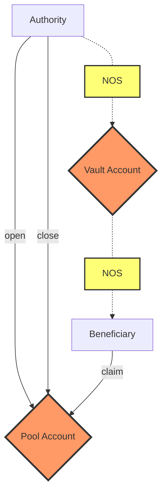

# Nosana Pools

The Nosana Pools program allows users to open token pools with predefined emission rates.

## Program Information

| Info            | Description                                                                                                                      |
|-----------------|----------------------------------------------------------------------------------------------------------------------------------|
| Type            | [Solana Program](https://docs.solana.com/developing/programming-model/overview)                                                  |
| Source Code     | [GitHub](https://github.com/nosana-ci/nosana-programs)                                                                           |
| Accounts        | `2`                                                                                                                              |
| Instructions    | `4`                                                                                                                              |
| Domain          | `nosana-pools.sol`                                                                                                               |
| Program Address | [`nosPdZrfDzND1LAR28FLMDEATUPK53K8xbRBXAirevD`](https://explorer.solana.com/address/nosPdZrfDzND1LAR28FLMDEATUPK53K8xbRBXAirevD) |
| APR             | [✅](https://www.apr.dev/program/nosPdZrfDzND1LAR28FLMDEATUPK53K8xbRBXAirevD)                                                     |

<!-- BEGIN_NOS_DOCS -->

## Instructions

A number of 4 instruction are defined in the Nosana Pools program.
To load the program with [Anchor](https://coral-xyz.github.io/anchor/ts/index.html) in `TypeScript`:

```typescript
const programId = new PublicKey('nosPdZrfDzND1LAR28FLMDEATUPK53K8xbRBXAirevD');
const idl = await Program.fetchIdl(programId.toString());
const program = new Program(idl, programId);
```

### Open

The `open()` instruction lets you open a Nosana Pool's [PoolAccount](#pool-account)
and [VaultAccount](#vault-account).

```typescript
let tx = await program.methods
  .open()
  .accounts({
    pool, // ✓ writable, ✓ signer
    vault, // ✓ writable, 𐄂 signer
    beneficiary, // 𐄂 writable, 𐄂 signer
    authority, // ✓ writable, ✓ signer
    mint, // 𐄂 writable, 𐄂 signer
    systemProgram, // 𐄂 writable, 𐄂 signer
    tokenProgram, // 𐄂 writable, 𐄂 signer
    rent, // 𐄂 writable, 𐄂 signer
  })
  .rpc();
```

### Claim Fee

The `claimFee()` instruction claims emissions from a Nosana Pool with claim type `1`,
and adds these as rewards (fees) to the [Rewards Program](/programs-rewards).

```typescript
let tx = await program.methods
  .claimFee()
  .accounts({
    vault, // ✓ writable, 𐄂 signer
    rewardsReflection, // ✓ writable, 𐄂 signer
    rewardsVault, // ✓ writable, 𐄂 signer
    pool, // ✓ writable, 𐄂 signer
    authority, // ✓ writable, ✓ signer
    tokenProgram, // 𐄂 writable, 𐄂 signer
    rewardsProgram, // 𐄂 writable, 𐄂 signer
  })
  .rpc();
```

### Claim Transfer

The `claimTransfer()` instruction claims emissions from a Nosana Pool with claim type `0`,
and transfer these to a given user.

```typescript
let tx = await program.methods
  .claimTransfer()
  .accounts({
    vault, // ✓ writable, 𐄂 signer
    beneficiary, // ✓ writable, 𐄂 signer
    pool, // ✓ writable, 𐄂 signer
    authority, // ✓ writable, ✓ signer
    tokenProgram, // 𐄂 writable, 𐄂 signer
  })
  .rpc();
```

### Close

The `close()` instruction closes a Nosana Pool's [PoolAccount](#pool-account)
and [VaultAccount](#vault-account)..

```typescript
let tx = await program.methods
  .close()
  .accounts({
    vault, // ✓ writable, 𐄂 signer
    user, // ✓ writable, 𐄂 signer
    pool, // ✓ writable, 𐄂 signer
    authority, // ✓ writable, ✓ signer
    tokenProgram, // 𐄂 writable, 𐄂 signer
  })
  .rpc();
```

## Accounts

A number of 1 accounts make up for the Nosana Pools Program's state.

### Vault Account

The `VaultAccount` is a regular Solana Token Account.

### Pool Account

The `PoolAccount` struct holds all the information for any given pool.

| Name | Type |
| ---- | ---- |
| `authority` | `publicKey` |
| `beneficiary` | `publicKey` |
| `claimType` | `u8` |
| `claimedTokens` | `u64` |
| `closeable` | `bool` |
| `emission` | `u64` |
| `startTime` | `i64` |
| `vault` | `publicKey` |
| `vaultBump` | `u8` |

<!-- END_NOS_DOCS -->

## Diagram


