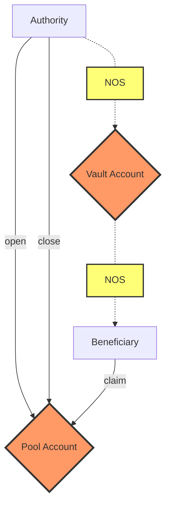

# Nosana Pools <Badge type="warning" text="mainnet" vertical="middle" />

The Nosana Pools program allows users to open token pools with predefined emission rates.

## Program Information

| Info            | Description                                                                                                                      |
|-----------------|----------------------------------------------------------------------------------------------------------------------------------|
| Type            | [Solana Program](https://docs.solana.com/developing/programming-model/overview)                                                  |
| Source Code     | [GitHub](https://github.com/nosana-ci/nosana-programs)                                                                           |
| Accounts        | `2`                                                                                                                              |
| Instructions    | `4`                                                                                                                              |
| Domain          | `nosana-pools.sol`                                                                                                               |
| Program Address | [`nosPdZrfDzND1LAR28FLMDEATUPK53K8xbRBXAirevD`](https://explorer.solana.com/address/nosPdZrfDzND1LAR28FLMDEATUPK53K8xbRBXAirevD) |
| APR             | [✅](https://www.apr.dev/program/nosPdZrfDzND1LAR28FLMDEATUPK53K8xbRBXAirevD)                                                     |

## Diagram



## Accounts

Only 2 account types makes up for the Nosana Pools programs' state.

### Vault Account

The `VaultAccount` is a regular Solana Token Account.

### Pool Account

The `PoolAccount` struct holds all the information for any given pool.

```rust
pub struct PoolAccount {
    pub authority: Pubkey,
    pub beneficiary: Pubkey,
    pub claim_type: u8,
    pub claimed_tokens: u64,
    pub closeable: bool,
    pub emission: u64,
    pub start_time: i64,
    pub vault: Pubkey,
    pub vault_bump: u8,
}
```

## Instructions

A number of 4 instruction are defined in the Nosana Pools program.
To load the program with [Anchor](https://coral-xyz.github.io/anchor/ts/index.html) in `TypeScript`:

```typescript
const programId = new PublicKey('nosPdZrfDzND1LAR28FLMDEATUPK53K8xbRBXAirevD');
const idl = await Program.fetchIdl(programId.toString());
const program = new Program(idl, programId);
```

### Open

The `open()` instruction lets you open a Nosana Pool.

```typescript
let tx = await program.methods
  .open(
    emission,
    startTime,
    claimType,
    closeable
  )
  .accounts({
    pool,
    vault,
    beneficiary,
    authority,
    mint,
    systemProgram,
    tokenProgram,
    rent
  })
  .signers([authorityKey, poolKey])
  .rpc();
```

### Claim Fee

The `claimFee()` instruction claims emissions from a Nosana Pool with claim type `1`,
and adds these as rewards (fees) to the RewardsProgram.

```typescript
let tx = await program.methods
  .claimFee()
  .accounts({
    vault,
    rewardsStats,
    rewardsVault,
    pool,
    authority,
    tokenProgram,
    rewardsProgram,
    systemProgram,
  })
  .signers([authority])
  .rpc()
```

### Claim Transfer

The `claimTransfer()` instruction claims emissions from a Nosana Pool with claim type `0`,
and transfer these to a given `user`.

```typescript
let tx = await program.methods
  .claimTransfer()
  .accounts({
    vault,
    beneficiary,
    pool,
    authority,
    tokenProgram,
    systemProgram,
  })
  .signers([authority])
  .rpc()
```

### Close

The `close()` instruction closes a Nosana Pool.

```typescript
let tx = await program.methods
  .close()
  .accounts({
    vault,
    user,
    pool,
    authority,
    tokenProgram,
  })
  .signers([authority])
  .rpc()
```
