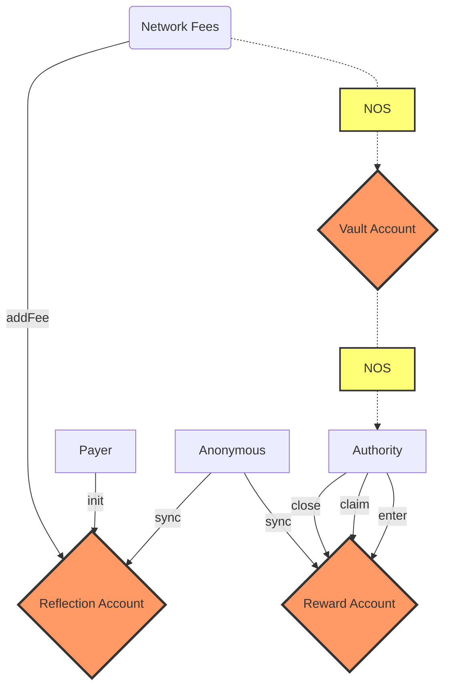

# Nosana Rewards

The Nosana Rewards Program allow stakers to earn rewards.
Anyone that has staked NOS tokens can enter the rewards program.

The following are some of the Nosana Rewards program's characteristics:

- A staker's xNOS score determines the portion of the fees a user will receive.
- You have to explicitly `enter` the rewards program to participate. The rewards
  you receive are the percentage of your xNOS compared to that of all the other participants.
- When new fees are added to the program, they are distributed to all current participants.
- The program uses a token reflection model to distribute: fees are accounted
  for "live" as they come in and no loops necessary.
- Anyone can send in new fees to be distributed using `add_fees`.
- You can `claim` your earned rewards at any time (does not require an
  unstake).
- If you `unstake` your reward account is voided. It is _critical_ that
  you claim rewards before unstaking.
- If you `upstake` or `extend` a stake your rewards program is not updated. You
  will have to `claim` upate your reward to make use of your new xNOS score.
- A user can only have 1 active rewards entry at a time.
- The rewards a user earns are automatically added to the percentage of rewards
  they receive. Earned rewards are added to their xNOS score (with a
  multiplier of 1) - but can be claimed without any delay.
  They gain a slight advandage from this, and it's a great feature as well.
  Also it's easy to `upstake` your  rewards directly in order to receive a bigger multiplier.
- One can close their own reward account at any time. If there are any unclaimed rewards on the account,
  they will be cancelled (and distributed to all other participants).
- Anyone is permitted to close a user's reward account if they've unstaked.
  This feature prevents "ghost" accounts from accumulating rewards.

<!-- BEGIN_NOS_DOCS -->

## Program Information

| Info            | Description                                                                                                                         |
|-----------------|-------------------------------------------------------------------------------------------------------------------------------------|
| Type            | [⚙️ Solana Program](https://docs.solana.com/developing/intro/programs#on-chain-programs)                                            |
| Source Code     | [👨‍💻GitHub](https://github.com/nosana-ci/nosana-programs)                                                                         |
| Build Status    | [✅ Anchor Verified](https://www.apr.dev/program/nosRB8DUV67oLNrL45bo2pFLrmsWPiewe2Lk2DRNYCp)                                        |
| Accounts        | [`3` account types](#accounts)                                                                                                      |
| Instructions    | [`6` instructions](#instructions)                                                                                                   |
| Domain          | 🌐 `nosana-rewards.sol`                                                                                                             |
| Program Address | [🧭 `nosRB8DUV67oLNrL45bo2pFLrmsWPiewe2Lk2DRNYCp`](https://explorer.solana.com/address/nosRB8DUV67oLNrL45bo2pFLrmsWPiewe2Lk2DRNYCp) |

## Instructions

A number of 6 instruction are defined in the Nosana Rewards program.
To load the program with [Anchor](https://coral-xyz.github.io/anchor/ts/index.html) in `TypeScript`:

```typescript
const programId = new PublicKey('nosRB8DUV67oLNrL45bo2pFLrmsWPiewe2Lk2DRNYCp');
const idl = await Program.fetchIdl(programId.toString());
const program = new Program(idl, programId);
```

### Init

The `init()` instruction initializes the [ReflectionAccount](#reflection-account)
and [VaultAccount](#vault-account).

```typescript
let tx = await program.methods
  .init()
  .accounts({
    mint,              // 𐄂 writable, 𐄂 signer
    reflection,        // ✓ writable, 𐄂 signer
    vault,             // ✓ writable, 𐄂 signer
    authority,         // ✓ writable, ✓ signer
    systemProgram,     // 𐄂 writable, 𐄂 signer
    tokenProgram,      // 𐄂 writable, 𐄂 signer
    rent,              // 𐄂 writable, 𐄂 signer
  })
  .rpc();
```

### Enter

The `enter()` instruction initializes a user's [RewardsAccount](#rewards-account).

```typescript
let tx = await program.methods
  .enter()
  .accounts({
    reflection,        // ✓ writable, 𐄂 signer
    stake,             // 𐄂 writable, 𐄂 signer
    reward,            // ✓ writable, 𐄂 signer
    authority,         // ✓ writable, ✓ signer
    systemProgram,     // 𐄂 writable, 𐄂 signer
  })
  .rpc();
```

### Add Fee

The `addFee()` instruction sends amount of tokens to the [VaultAccount](#vault-account).

```typescript
let tx = await program.methods
  .addFee(
    amount             // type: u64
  )
  .accounts({
    user,              // ✓ writable, 𐄂 signer
    reflection,        // ✓ writable, 𐄂 signer
    vault,             // ✓ writable, 𐄂 signer
    authority,         // 𐄂 writable, ✓ signer
    tokenProgram,      // 𐄂 writable, 𐄂 signer
  })
  .rpc();
```

### Claim
The `claim()` instruction sends a user's rewards to a given wallet.

```typescript
let tx = await program.methods
  .claim()
  .accounts({
    user,              // ✓ writable, 𐄂 signer
    vault,             // ✓ writable, 𐄂 signer
    reflection,        // ✓ writable, 𐄂 signer
    reward,            // ✓ writable, 𐄂 signer
    stake,             // 𐄂 writable, 𐄂 signer
    authority,         // ✓ writable, ✓ signer
    tokenProgram,      // 𐄂 writable, 𐄂 signer
  })
  .rpc();
```

### Sync

The `sync()` instruction re-calculates a users' reflection score.

```typescript
let tx = await program.methods
  .sync()
  .accounts({
    reward,            // ✓ writable, 𐄂 signer
    stake,             // 𐄂 writable, 𐄂 signer
    reflection,        // ✓ writable, 𐄂 signer
  })
  .rpc();
```

### Close

The `close()` instruction closes a users' [RewardsAccount](#rewards-account).

```typescript
let tx = await program.methods
  .close()
  .accounts({
    reflection,        // ✓ writable, 𐄂 signer
    reward,            // ✓ writable, 𐄂 signer
    authority,         // ✓ writable, ✓ signer
  })
  .rpc();
```

## Accounts

A number of 3 accounts make up for the Nosana Rewards Program's state.

### Vault Account

The `VaultAccount` is a regular Solana Token Account.

### Reflection Account

The `ReflectionAccount` struct holds all the information on the reflection pool.

| Name                                  | Type                                  |
|---------------------------------------|---------------------------------------|
| `rate`                                | `u128`                                |
| `totalReflection`                     | `u128`                                |
| `totalXnos`                           | `u128`                                |
| `vault`                               | `publicKey`                           |
| `vaultBump`                           | `u8`                                  |

### Reward Account

The `RewardAccount` struct holds all the information for any given user account.

| Name                                  | Type                                  |
|---------------------------------------|---------------------------------------|
| `authority`                           | `publicKey`                           |
| `bump`                                | `u8`                                  |
| `reflection`                          | `u128`                                |
| `xnos`                                | `u128`                                |

<!-- END_NOS_DOCS -->

## Diagram


