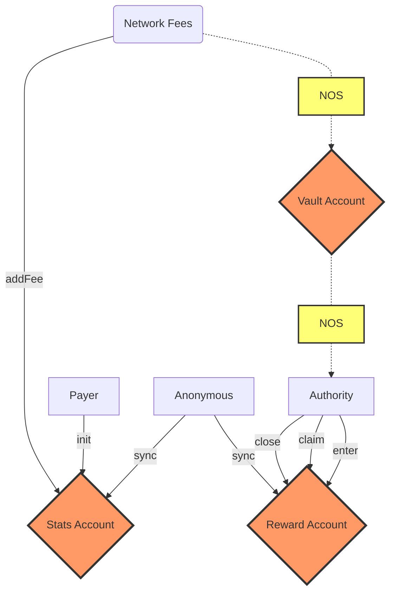

# Nosana Rewards <Badge type="tip" text="mainnet" vertical="middle" />

## Program Information

The rewards program allow stakers to earn rewards. Anyone that has a stake can
enter the rewards program.

| Info            | Description                                                                                                                      |
|-----------------|----------------------------------------------------------------------------------------------------------------------------------|
| Type            | [Solana Program](https://docs.solana.com/developing/programming-model/overview)                                                  |
| Source Code     | [GitHub](https://github.com/nosana-ci/nosana-programs)                                                                           |
| Accounts        | `3`                                                                                                                              |
| Instructions    | `6`                                                                                                                              |
| Domain          | `nosana-rewards.sol`                                                                                                             |
| Program Address | [`nosRB8DUV67oLNrL45bo2pFLrmsWPiewe2Lk2DRNYCp`](https://explorer.solana.com/address/nosRB8DUV67oLNrL45bo2pFLrmsWPiewe2Lk2DRNYCp) |
| APR             | [✅](https://www.apr.dev/program/nosRB8DUV67oLNrL45bo2pFLrmsWPiewe2Lk2DRNYCp)                                                     |

## Diagram



## Accounts

A number of 3 account types makes up for the Nosana Rewards programs' state.

### Vault Account

The `VaultAccount` is a regular Solana Token Account.

### Reward Account

The `RewardAccount` struct holds all the information for any given user account.

```rust
pub struct RewardAccount {
  pub authority: Pubkey,
  pub bump: u8,
  pub reflection: u128,
  pub xnos: u128,
}
```

### Stats Account

The `StatsAccount` struct holds all the information on the reflection pool.

```rust
pub struct StatsAccount {
    pub bump: u8,
    pub rate: u128,
    pub total_reflection: u128,
    pub total_xnos: u128,
}
```

## Instructions

A number of 6 instruction are defined in the Nosana Rewards program.
To load the program with [Anchor](https://coral-xyz.github.io/anchor/ts/index.html) in `TypeScript`:

```typescript
const programId = new PublicKey('nosRB8DUV67oLNrL45bo2pFLrmsWPiewe2Lk2DRNYCp');
const idl = await Program.fetchIdl(programId.toString());
const program = new Program(idl, programId);
```

These are some of the properties of the rewards program:

- A stakers' xNOS score determines the portion of the fees a user will receive.
- You have to explicitly `enter` the rewards program to participate. The rewards
  you receive are the percentage of your xNOS from all the participants.
- Everytime a fee is added to the program it is distributed to all the current
  participants.
- The program uses a token reflection model to distribute: fees are accounted
  for "live" as they come in and no loops necessary.
- Anyone can send in new fees to be distributed using `add_fees`.
- You can `claim` your earned rewards at any time (does not require an
  unstake).
- If you `unstake` your reward account is voided. It is _very_ important that
  you claim rewards before unstaking.
- If you `upstake` or `extend` a stake your rewards program is not updated. You
  will have to `claim` upate your reward to make use of your new xNOS score.
- A user can only have 1 active rewards entry at a time
- The rewards a user earns are automatically added to the percentage of rewards
  he receives. Earned rewards are basically added to his xNOS score (with
  multiplier 1) - but can be claimed without any delay. This gives them a small
  advantage but is also a nice feature. Also it should be easy to `upstake` your
  rewards directly to get a higher multiplier for them.
- One can always close their own reward account. If the account has any
  unclaimed rewards they will be voided (distributed to all other participants).
- If a user unstaked anyone is allowed to close their reward account. This way
  there will not be "ghosts" accounts accumulating rewards.

### Init

The `init()` instruction initializes the [`StatsAccount`](#stats-account) 
and [`VaultAccount`](#vault-account).

```typescript
let tx = await program.methods
  .init()
  .accounts({
    mint,
    stats,
    vault,
    authority,
    systemProgram,
    tokenProgram,
    rent,
  })
  .signers([authorityKey])
  .rpc();
```

### Enter

The `enter()` instruction initializes a users' [`RewardsAccount`](#reward-account).

```typescript
let tx = await program.methods
  .enter()
  .accounts({
    stats,
    stake,
    reward,
    authority,
    systemProgram,
  })
  .signers([authorityKey])
  .rpc();
```

### Claim

The `claim()` instruction sends a users' rewards to a given wallet.

```typescript
let tx = await program.methods
  .claim()
  .accounts({
    user,
    vault,
    stats,
    reward,
    stake,
    authority,
    tokenProgram,
  })
  .signers([authorityKey])
  .rpc();
```

### Sync

The `sync()` instruction re-calculates a users' `xNOS` score.

```typescript
let tx = await program.methods
  .sync()
  .accounts({
    reward,
    stake,
    stats,
  })
  .rpc();
```

### Close

The `close()` instruction closes a users' [`RewardsAccount`](#reward-account).

```typescript
let tx = await program.methods
  .close()
  .accounts({
    stats,
    reward,
    authority,
  })
  .signers([authorityKey])
  .rpc();
```

### Add Fee

The `addFee()` instruction sends `amount` of tokens to the [`VaultAccount`](#vault-account).

```typescript
let tx = await program.methods
  .addFee(amount)
  .accounts({
    user,
    stats,
    vault,
    systemProgram,
    authority,
    tokenProgram,
  })
  .signers([authorityKey])
  .rpc();
```
