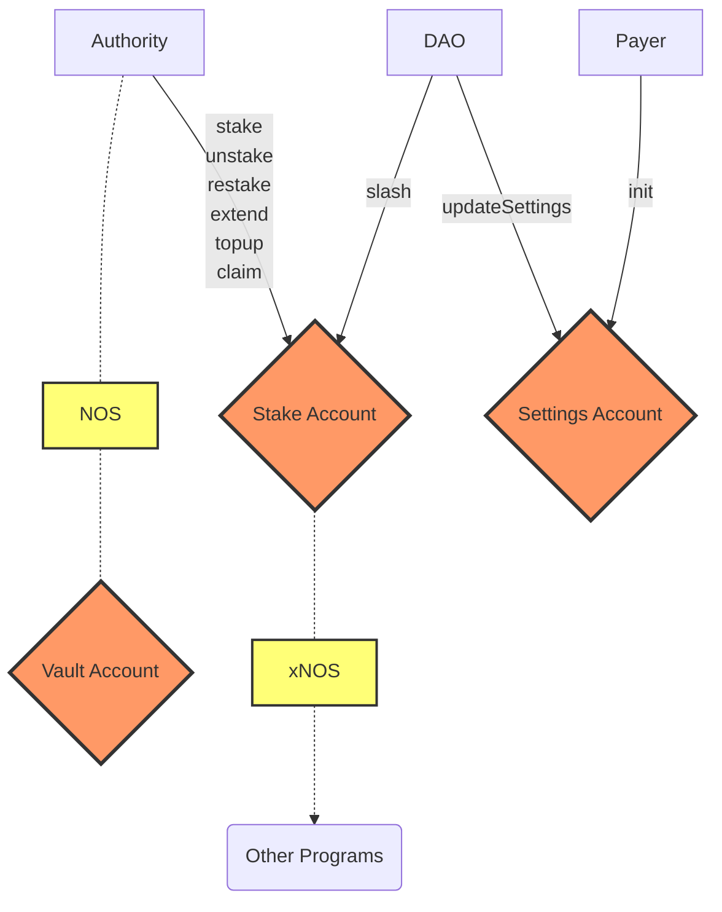

# Nosana Staking <Badge type="tip" text="mainnet" vertical="middle" />

The staking program allows users to stake `NOS` tokens for a variable amount of time.
There are 2 values associated with a users stake:

- Staked NOS
- xNOS (Staked NOS x duration)

The staked NOS is the amount of tokens that the vault actually holds for the user that can be slashed or unstaked,
while xNOS is a value indicating a users rank for purposes like giveaways and voting.

## Program Information

| Info            | Description                                                                                                                      |
|-----------------|----------------------------------------------------------------------------------------------------------------------------------|
| Type            | [Solana Program](https://docs.solana.com/developing/programming-model/overview)                                                  |
| Source Code     | [GitHub](https://github.com/nosana-ci/nosana-programs)                                                                           |
| Accounts        | `3`                                                                                                                              |
| Instructions    | `9`                                                                                                                              |
| Domain          | `nosana-staking.sol`                                                                                                             |
| Program Address | [`nosScmHY2uR24Zh751PmGj9ww9QRNHewh9H59AfrTJE`](https://explorer.solana.com/address/nosScmHY2uR24Zh751PmGj9ww9QRNHewh9H59AfrTJE) |
| APR             | [✅](https://www.apr.dev/program/nosScmHY2uR24Zh751PmGj9ww9QRNHewh9H59AfrTJE)                                                     |

## Diagram



## Accounts

A number of 3 account types make up for the Nosana Staking programs' state.

### Vault Account

The `VaultAccount` is a regular Solana Token Account.

### Stake Account

The `StakeAccount` struct holds all the information for any given stake.

```rust
pub struct StakeAccount {
    pub amount: u64,
    pub authority: Pubkey,
    pub duration: u64,
    pub time_unstake: i64,
    pub vault: Pubkey,
    pub vault_bump: u8,
    pub xnos: u128,
}
```

### Settings Account

The `SettingsAccount` struct holds the information about the slashing authority and token account.

```rust
pub struct SettingsAccount {
    pub authority: Pubkey,
    pub token_account: Pubkey,
}
```

## Instructions

A number of 9 instruction are defined in the Nosana Staking program.
To load the program with [Anchor](https://coral-xyz.github.io/anchor/ts/index.html) in `TypeScript`:

```typescript
const programId = new PublicKey('nosScmHY2uR24Zh751PmGj9ww9QRNHewh9H59AfrTJE');
const idl = await Program.fetchIdl(programId.toString());
const program = new Program(idl, programId);
```

### Init

The `init()` instruction initializes the SettingsAccount of the Nosana Staking program.

```typescript
let tx = await program.methods
  .init()
  .accounts({
    settings,
    authority,
    systemProgram,
    rent,
  })
  .signers([authorityKey])
  .rpc();
```

### Stake

The `stake()` instruction creates a new stake for the `authority`.
It initializes a unique `vault` Token Account for the staker.
This will transfer `amount` of NOS tokens from `user` to the `vault` locked for `duration` seconds of time.
The stake account is a PDA based on the `authority`.

```typescript
let tx = await program.methods
  .stake(
    amount,
    duration
  )
  .accounts({
    mint,
    user,
    vault,
    stake,
    authority,
    systemProgram,
    tokenProgram,
    rent,
  })
  .signers([authorityKey])
  .rpc();
```

### Topup

The `topup()` instruction performs a top-up of an existing stake.
`amount` of NOS is transferred to `ata_vault` and the tokens at `stake` are incremented.

- You can only top-up if the `stake` is not unstaked yet
- A top-up is always for the duration of the original `stake`

```typescript
let tx = await program.methods
  .topup(amount)
  .accounts({
    user,
    vault,
    stake,
    authority,
    tokenProgram,
  })
  .signers([authorityKey])
  .rpc();
```

### Extend

The `extend()` instruction extends the duration of a stake.
The duration can only be increased which will result in a higher `xnos`.

```typescript
let tx = await program.methods
  .extend(duration)
  .accounts({
    stake,
    authority,
  })
  .signers([authorityKey])
  .rpc();
```

### Restake

The `restake()` instruction undoes an unstake.
This will make a stake active again and reset the unstake time.

```typescript
let tx = await program.methods
  .restake()
  .accounts({
    stake,
    authority,
  })
  .signers([authorityKey])
  .rpc();
```

### Unstake

The `unstake()` instruction will initiate the unstake delay.

```typescript
let tx = await program.methods
  .unstake()
  .accounts({
    stake,
    authority,
  })
  .signers([authorityKey])
  .rpc();
```

### Claim

The `unstake()` instruction will transfer back all your `stake` tokens if the delay has passed after they whey unstaked.
Claiming will close the `stake` account.

```typescript
let tx = await program.methods
  .claim()
  .accounts({
    user,
    vault,
    stake,
    authority,
    tokenProgram,
  })
  .signers([authorityKey])
  .rpc();
```

### Slash

The `unstake()` instruction reduces a stakes' NOS tokens.
This can only be done by the slashing authority declared in `SettingsAccount.Authority`.
The tokens that are slashed will be sent to the `SettingsAccount.TokenAccount` account.

Slashing is a feature used by the Nosana protocol to punish bad actors.

```typescript
let tx = await program.methods
  .slash(amount)
  .accounts({
    settings,
    stake,
    tokenAccount,
    vault,
    authority,
    tokenProgram,
  })
  .signers([authorityKey])
  .rpc();
```

### Update Setting

The `updateSettings()` instruction sets the slashing authority in `SettingsAccount.Authority` to a new account.
It also sets the token account in `SettingsAccount.TokenAccount` to a new account.
This can only by called by the current authority.

```typescript
let tx = await program.methods
  .slash()
  .accounts({
    newAuthority,
    tokenAccount,
    settings,
    authority,
  })
  .signers([authorityKey])
  .rpc();
```
