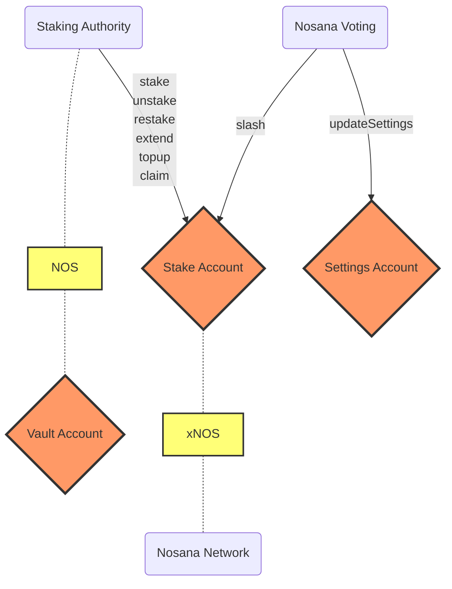

# Nosana Staking

The staking program allows users to stake `NOS` tokens for a variable amount of time.
There are 2 values associated with a users stake:

- Staked NOS
- xNOS (Staked NOS x duration)

The staked NOS is the amount of tokens that the vault actually holds for the user that can be slashed or unstaked,
while xNOS is a value indicating a users rank for purposes like giveaways and voting.

<!-- BEGIN_NOS_DOCS -->

## Program Information

| Info            | Description                                                                                                                         |
|-----------------|-------------------------------------------------------------------------------------------------------------------------------------|
| Type            | [Solana Program](https://docs.solana.com/developing/intro/programs#on-chain-programs)                                               |
| Source Code     | [GitHub](https://github.com/nosana-ci/nosana-programs)                                                                              |
| Build Status    | [Anchor Verified](https://www.apr.dev/program/nosScmHY2uR24Zh751PmGj9ww9QRNHewh9H59AfrTJE)                                          |
| Accounts        | [`3`](#accounts)                                                                                                                    |
| Instructions    | [`9`](#instructions)                                                                                                                |
| Types           | [`0`](#types)                                                                                                                       |
| Domain          | `nosana-staking.sol`                                                                                                                |
|  Address        | [`nosScmHY2uR24Zh751PmGj9ww9QRNHewh9H59AfrTJE`](https://explorer.solana.com/address/nosScmHY2uR24Zh751PmGj9ww9QRNHewh9H59AfrTJE)    |

## Instructions

A number of 9 instruction are defined in the Nosana Staking program.

To load the program with [Anchor](https://coral-xyz.github.io/anchor/ts/index.html).

```typescript
const programId = new PublicKey('nosScmHY2uR24Zh751PmGj9ww9QRNHewh9H59AfrTJE');
const idl = await Program.fetchIdl(programId.toString());
const program = new Program(idl, programId);
```

:::: tabs
@tab Init
### Init

The `init()` instruction initializes the [SettingsAccount](#settings-account)
of the Nosana Staking program.

#### Account Info

| Name                   | Type                                                                                    | Description                                                                                       |
|------------------------|-----------------------------------------------------------------------------------------|---------------------------------------------------------------------------------------------------|
| `settings`             | <FontIcon icon="pencil" color="#3EAF7C" /><FontIcon icon="key" color="lightgrey" />     | The [SettingsAccount](#settings-account) address.                                                 |
| `authority`            | <FontIcon icon="pencil" color="#3EAF7C" /><FontIcon icon="key" color="#3EAF7C" />       | The signing authority of the program invocation.                                                  |
| `systemProgram`        | <FontIcon icon="pencil" color="lightgrey" /><FontIcon icon="key" color="lightgrey" />   | The official Solana system program address. Responsible for system CPIs.                          |
| `rent`                 | <FontIcon icon="pencil" color="lightgrey" /><FontIcon icon="key" color="lightgrey" />   | The official Solana rent address. Responsible for lamports.                                       |


::: details Solana Dispatch ID

The Solana dispatch ID for the Init Instruction
is **`dc3bcfec6cfa2f64`**,
which can also be expressed as an 8 byte discriminator:

```json
[
  220,
  59,
  207,
  236,
  108,
  250,
  47,
  100
]
```

:::
::: details Example with Anchor

To run the instructions with [Anchor](https://coral-xyz.github.io/anchor/ts/index.html).

```typescript
let tx = await program.methods
  .init()
  .accounts({
    settings,          // ✓ writable, 𐄂 signer
    authority,         // ✓ writable, ✓ signer
    systemProgram,     // 𐄂 writable, 𐄂 signer
    rent,              // 𐄂 writable, 𐄂 signer
  })
  .signers([authorityKey])
  .rpc();
```

@tab Stake
### Stake

The `stake()` instruction creates a new stake [StakeAccount](#stake-account)
for the authority. It initializes a unique [VaultAccount](#vault-account) for the staker.
It transfers `amount` of [NOS](/tokens/token) tokens from user to the vault locked for
duration seconds of time. The stake and vault account is a PDA based on the authority.

#### Account Info

| Name                   | Type                                                                                    | Description                                                                                       |
|------------------------|-----------------------------------------------------------------------------------------|---------------------------------------------------------------------------------------------------|
| `mint`                 | <FontIcon icon="pencil" color="lightgrey" /><FontIcon icon="key" color="lightgrey" />   | The token Mint address for this instruction.                                                      |
| `user`                 | <FontIcon icon="pencil" color="#3EAF7C" /><FontIcon icon="key" color="lightgrey" />     | The user token account that will debit/credit the tokens.                                         |
| `vault`                | <FontIcon icon="pencil" color="#3EAF7C" /><FontIcon icon="key" color="lightgrey" />     | The [VaultAccount](#vault-account) address.                                                       |
| `stake`                | <FontIcon icon="pencil" color="#3EAF7C" /><FontIcon icon="key" color="lightgrey" />     | The [StakeAccount](/programs/staking#stake-account) address.                                      |
| `authority`            | <FontIcon icon="pencil" color="#3EAF7C" /><FontIcon icon="key" color="#3EAF7C" />       | The signing authority of the program invocation.                                                  |
| `systemProgram`        | <FontIcon icon="pencil" color="lightgrey" /><FontIcon icon="key" color="lightgrey" />   | The official Solana system program address. Responsible for system CPIs.                          |
| `tokenProgram`         | <FontIcon icon="pencil" color="lightgrey" /><FontIcon icon="key" color="lightgrey" />   | The official SPL Token Program address. Responsible for token CPIs.                               |
| `rent`                 | <FontIcon icon="pencil" color="lightgrey" /><FontIcon icon="key" color="lightgrey" />   | The official Solana rent address. Responsible for lamports.                                       |

#### Arguments

| Name                   | Type              | Size    | Offset  | Description                                               |
|------------------------|-------------------|---------|---------|-----------------------------------------------------------|
| `amount`               | `u64`             | `8`     | `0`     | The number of tokens.                                     |
| `duration`             | `u128`            | `16`    | `8`     | The duration of the stake.                                |


::: details Solana Dispatch ID

The Solana dispatch ID for the Stake Instruction
is **`ceb0ca12c8d1b36c`**,
which can also be expressed as an 8 byte discriminator:

```json
[
  206,
  176,
  202,
  18,
  200,
  209,
  179,
  108
]
```

:::
::: details Example with Anchor

To run the instructions with [Anchor](https://coral-xyz.github.io/anchor/ts/index.html).

```typescript
let tx = await program.methods
  .stake(
    amount,            // type: u64
    duration,          // type: u128
  )
  .accounts({
    mint,              // 𐄂 writable, 𐄂 signer
    user,              // ✓ writable, 𐄂 signer
    vault,             // ✓ writable, 𐄂 signer
    stake,             // ✓ writable, 𐄂 signer
    authority,         // ✓ writable, ✓ signer
    systemProgram,     // 𐄂 writable, 𐄂 signer
    tokenProgram,      // 𐄂 writable, 𐄂 signer
    rent,              // 𐄂 writable, 𐄂 signer
  })
  .signers([authorityKey])
  .rpc();
```

@tab Unstake
### Unstake

The `unstake()` instruction will initiate the unstake delay.

#### Account Info

| Name                   | Type                                                                                    | Description                                                                                       |
|------------------------|-----------------------------------------------------------------------------------------|---------------------------------------------------------------------------------------------------|
| `stake`                | <FontIcon icon="pencil" color="#3EAF7C" /><FontIcon icon="key" color="lightgrey" />     | The [StakeAccount](/programs/staking#stake-account) address.                                      |
| `reward`               | <FontIcon icon="pencil" color="lightgrey" /><FontIcon icon="key" color="lightgrey" />   | The [RewardAccount](#reward-account) address.                                                     |
| `authority`            | <FontIcon icon="pencil" color="lightgrey" /><FontIcon icon="key" color="#3EAF7C" />     | The signing authority of the program invocation.                                                  |


::: details Solana Dispatch ID

The Solana dispatch ID for the Unstake Instruction
is **`5a5f6b2acd7c32e1`**,
which can also be expressed as an 8 byte discriminator:

```json
[
  90,
  95,
  107,
  42,
  205,
  124,
  50,
  225
]
```

:::
::: details Example with Anchor

To run the instructions with [Anchor](https://coral-xyz.github.io/anchor/ts/index.html).

```typescript
let tx = await program.methods
  .unstake()
  .accounts({
    stake,             // ✓ writable, 𐄂 signer
    reward,            // 𐄂 writable, 𐄂 signer
    authority,         // 𐄂 writable, ✓ signer
  })
  .signers([authorityKey])
  .rpc();
```

@tab Restake
### Restake

The `restake()` instruction undoes an unstake.
This will make a stake active again and reset the unstake time.

#### Account Info

| Name                   | Type                                                                                    | Description                                                                                       |
|------------------------|-----------------------------------------------------------------------------------------|---------------------------------------------------------------------------------------------------|
| `stake`                | <FontIcon icon="pencil" color="#3EAF7C" /><FontIcon icon="key" color="lightgrey" />     | The [StakeAccount](/programs/staking#stake-account) address.                                      |
| `authority`            | <FontIcon icon="pencil" color="lightgrey" /><FontIcon icon="key" color="#3EAF7C" />     | The signing authority of the program invocation.                                                  |


::: details Solana Dispatch ID

The Solana dispatch ID for the Restake Instruction
is **`61a1f1a70620d535`**,
which can also be expressed as an 8 byte discriminator:

```json
[
  97,
  161,
  241,
  167,
  6,
  32,
  213,
  53
]
```

:::
::: details Example with Anchor

To run the instructions with [Anchor](https://coral-xyz.github.io/anchor/ts/index.html).

```typescript
let tx = await program.methods
  .restake()
  .accounts({
    stake,             // ✓ writable, 𐄂 signer
    authority,         // 𐄂 writable, ✓ signer
  })
  .signers([authorityKey])
  .rpc();
```

@tab Topup
### Topup

The `topup()` instruction performs a top-up of an existing stake.
An `amount` of NOS is transferred to the vault and the stake is update.

#### Account Info

| Name                   | Type                                                                                    | Description                                                                                       |
|------------------------|-----------------------------------------------------------------------------------------|---------------------------------------------------------------------------------------------------|
| `user`                 | <FontIcon icon="pencil" color="#3EAF7C" /><FontIcon icon="key" color="lightgrey" />     | The user token account that will debit/credit the tokens.                                         |
| `vault`                | <FontIcon icon="pencil" color="#3EAF7C" /><FontIcon icon="key" color="lightgrey" />     | The [VaultAccount](#vault-account) address.                                                       |
| `stake`                | <FontIcon icon="pencil" color="#3EAF7C" /><FontIcon icon="key" color="lightgrey" />     | The [StakeAccount](/programs/staking#stake-account) address.                                      |
| `authority`            | <FontIcon icon="pencil" color="lightgrey" /><FontIcon icon="key" color="#3EAF7C" />     | The signing authority of the program invocation.                                                  |
| `tokenProgram`         | <FontIcon icon="pencil" color="lightgrey" /><FontIcon icon="key" color="lightgrey" />   | The official SPL Token Program address. Responsible for token CPIs.                               |

#### Arguments

| Name                   | Type              | Size    | Offset  | Description                                               |
|------------------------|-------------------|---------|---------|-----------------------------------------------------------|
| `amount`               | `u64`             | `8`     | `0`     | The number of tokens.                                     |


::: details Solana Dispatch ID

The Solana dispatch ID for the Topup Instruction
is **`7e2a314ee197634d`**,
which can also be expressed as an 8 byte discriminator:

```json
[
  126,
  42,
  49,
  78,
  225,
  151,
  99,
  77
]
```

:::
::: details Example with Anchor

To run the instructions with [Anchor](https://coral-xyz.github.io/anchor/ts/index.html).

```typescript
let tx = await program.methods
  .topup(
    amount,            // type: u64
  )
  .accounts({
    user,              // ✓ writable, 𐄂 signer
    vault,             // ✓ writable, 𐄂 signer
    stake,             // ✓ writable, 𐄂 signer
    authority,         // 𐄂 writable, ✓ signer
    tokenProgram,      // 𐄂 writable, 𐄂 signer
  })
  .signers([authorityKey])
  .rpc();
```

@tab Extend
### Extend

The `extend()` instruction extends the duration of a stake.
The duration can only be increased which will result in a higher `xnos`.

#### Account Info

| Name                   | Type                                                                                    | Description                                                                                       |
|------------------------|-----------------------------------------------------------------------------------------|---------------------------------------------------------------------------------------------------|
| `stake`                | <FontIcon icon="pencil" color="#3EAF7C" /><FontIcon icon="key" color="lightgrey" />     | The [StakeAccount](/programs/staking#stake-account) address.                                      |
| `authority`            | <FontIcon icon="pencil" color="lightgrey" /><FontIcon icon="key" color="#3EAF7C" />     | The signing authority of the program invocation.                                                  |

#### Arguments

| Name                   | Type              | Size    | Offset  | Description                                               |
|------------------------|-------------------|---------|---------|-----------------------------------------------------------|
| `duration`             | `u64`             | `8`     | `0`     | The duration of the stake.                                |


::: details Solana Dispatch ID

The Solana dispatch ID for the Extend Instruction
is **`e47f0001e39a36a8`**,
which can also be expressed as an 8 byte discriminator:

```json
[
  228,
  127,
  0,
  1,
  227,
  154,
  54,
  168
]
```

:::
::: details Example with Anchor

To run the instructions with [Anchor](https://coral-xyz.github.io/anchor/ts/index.html).

```typescript
let tx = await program.methods
  .extend(
    duration,          // type: u64
  )
  .accounts({
    stake,             // ✓ writable, 𐄂 signer
    authority,         // 𐄂 writable, ✓ signer
  })
  .signers([authorityKey])
  .rpc();
```

@tab Claim
### Claim

The `claim()` instruction will transfer back all your stake tokens if the delay has
passed after they whey unstaked. Claiming will close the [StakeAccount](#stake-account)
and [VaultAccount](#vault-account) of the staker.

#### Account Info

| Name                   | Type                                                                                    | Description                                                                                       |
|------------------------|-----------------------------------------------------------------------------------------|---------------------------------------------------------------------------------------------------|
| `user`                 | <FontIcon icon="pencil" color="#3EAF7C" /><FontIcon icon="key" color="lightgrey" />     | The user token account that will debit/credit the tokens.                                         |
| `vault`                | <FontIcon icon="pencil" color="#3EAF7C" /><FontIcon icon="key" color="lightgrey" />     | The [VaultAccount](#vault-account) address.                                                       |
| `stake`                | <FontIcon icon="pencil" color="#3EAF7C" /><FontIcon icon="key" color="lightgrey" />     | The [StakeAccount](/programs/staking#stake-account) address.                                      |
| `authority`            | <FontIcon icon="pencil" color="#3EAF7C" /><FontIcon icon="key" color="#3EAF7C" />       | The signing authority of the program invocation.                                                  |
| `tokenProgram`         | <FontIcon icon="pencil" color="lightgrey" /><FontIcon icon="key" color="lightgrey" />   | The official SPL Token Program address. Responsible for token CPIs.                               |


::: details Solana Dispatch ID

The Solana dispatch ID for the Claim Instruction
is **`3ec6d6c1d59f6cd2`**,
which can also be expressed as an 8 byte discriminator:

```json
[
  62,
  198,
  214,
  193,
  213,
  159,
  108,
  210
]
```

:::
::: details Example with Anchor

To run the instructions with [Anchor](https://coral-xyz.github.io/anchor/ts/index.html).

```typescript
let tx = await program.methods
  .claim()
  .accounts({
    user,              // ✓ writable, 𐄂 signer
    vault,             // ✓ writable, 𐄂 signer
    stake,             // ✓ writable, 𐄂 signer
    authority,         // ✓ writable, ✓ signer
    tokenProgram,      // 𐄂 writable, 𐄂 signer
  })
  .signers([authorityKey])
  .rpc();
```

@tab Slash
### Slash

The `slash()` instruction reduces a stake's NOS tokens. This can only be done by the
Slashing Authority declared in [SettingsAccount](#settings-account) authority. The tokens
are be sent to the [SettingsAccount](#settings-account) tokenAccount account.

Slashing is a feature used by the Nosana Protocol to punish bad actors.

#### Account Info

| Name                   | Type                                                                                    | Description                                                                                       |
|------------------------|-----------------------------------------------------------------------------------------|---------------------------------------------------------------------------------------------------|
| `settings`             | <FontIcon icon="pencil" color="lightgrey" /><FontIcon icon="key" color="lightgrey" />   | The [SettingsAccount](#settings-account) address.                                                 |
| `stake`                | <FontIcon icon="pencil" color="#3EAF7C" /><FontIcon icon="key" color="lightgrey" />     | The [StakeAccount](/programs/staking#stake-account) address.                                      |
| `tokenAccount`         | <FontIcon icon="pencil" color="#3EAF7C" /><FontIcon icon="key" color="lightgrey" />     | The token account where slash deposits will go.                                                   |
| `vault`                | <FontIcon icon="pencil" color="#3EAF7C" /><FontIcon icon="key" color="lightgrey" />     | The [VaultAccount](#vault-account) address.                                                       |
| `authority`            | <FontIcon icon="pencil" color="lightgrey" /><FontIcon icon="key" color="#3EAF7C" />     | The signing authority of the program invocation.                                                  |
| `tokenProgram`         | <FontIcon icon="pencil" color="lightgrey" /><FontIcon icon="key" color="lightgrey" />   | The official SPL Token Program address. Responsible for token CPIs.                               |

#### Arguments

| Name                   | Type              | Size    | Offset  | Description                                               |
|------------------------|-------------------|---------|---------|-----------------------------------------------------------|
| `amount`               | `u64`             | `8`     | `0`     | The number of tokens.                                     |


::: details Solana Dispatch ID

The Solana dispatch ID for the Slash Instruction
is **`cc8d12a108b15c8e`**,
which can also be expressed as an 8 byte discriminator:

```json
[
  204,
  141,
  18,
  161,
  8,
  177,
  92,
  142
]
```

:::
::: details Example with Anchor

To run the instructions with [Anchor](https://coral-xyz.github.io/anchor/ts/index.html).

```typescript
let tx = await program.methods
  .slash(
    amount,            // type: u64
  )
  .accounts({
    settings,          // 𐄂 writable, 𐄂 signer
    stake,             // ✓ writable, 𐄂 signer
    tokenAccount,      // ✓ writable, 𐄂 signer
    vault,             // ✓ writable, 𐄂 signer
    authority,         // 𐄂 writable, ✓ signer
    tokenProgram,      // 𐄂 writable, 𐄂 signer
  })
  .signers([authorityKey])
  .rpc();
```

@tab Update Settings
### Update Settings

The `updateSettings()` instruction sets the Slashing Authority to a new account. It also
sets the token account to a `tokenAccount`. This may be done by the current `authority`.

#### Account Info

| Name                   | Type                                                                                    | Description                                                                                       |
|------------------------|-----------------------------------------------------------------------------------------|---------------------------------------------------------------------------------------------------|
| `newAuthority`         | <FontIcon icon="pencil" color="lightgrey" /><FontIcon icon="key" color="lightgrey" />   | The new authority of the  [SettingsAccount](#settings-account).                                   |
| `tokenAccount`         | <FontIcon icon="pencil" color="lightgrey" /><FontIcon icon="key" color="lightgrey" />   | The token account where slash deposits will go.                                                   |
| `settings`             | <FontIcon icon="pencil" color="#3EAF7C" /><FontIcon icon="key" color="lightgrey" />     | The [SettingsAccount](#settings-account) address.                                                 |
| `authority`            | <FontIcon icon="pencil" color="lightgrey" /><FontIcon icon="key" color="#3EAF7C" />     | The signing authority of the program invocation.                                                  |


::: details Solana Dispatch ID

The Solana dispatch ID for the Update Settings Instruction
is **`51a633d59e549d6c`**,
which can also be expressed as an 8 byte discriminator:

```json
[
  81,
  166,
  51,
  213,
  158,
  84,
  157,
  108
]
```

:::
::: details Example with Anchor

To run the instructions with [Anchor](https://coral-xyz.github.io/anchor/ts/index.html).

```typescript
let tx = await program.methods
  .updateSettings()
  .accounts({
    newAuthority,      // 𐄂 writable, 𐄂 signer
    tokenAccount,      // 𐄂 writable, 𐄂 signer
    settings,          // ✓ writable, 𐄂 signer
    authority,         // 𐄂 writable, ✓ signer
  })
  .signers([authorityKey])
  .rpc();
```

:::
::::
## Accounts

A number of 3 accounts make up for the Nosana Staking Program's state.

:::: tabs

@tab Settings Account
### Settings Account

The `SettingsAccount` struct holds the information about the
slashing authority and token account.

The total size of this account is `72` bytes.
| Name                        | Type                        | Size    | Offset  | Description                                                                                       |
|-----------------------------|-----------------------------|---------|---------|---------------------------------------------------------------------------------------------------|
| `authority`                 | `publicKey`                 | `32`    | `8`     | The signing authority of the program invocation.                                                  |
| `tokenAccount`              | `publicKey`                 | `32`    | `40`    | The token account where slash deposits will go.                                                   |

::: details Discriminator

The Settings Account's 8 byte discriminator is:

```json
[
  63,
  89,
  203,
  155,
  76,
  237,
  115,
  58
]
```

@tab Stake Account
### Stake Account

The `StakeAccount` struct holds all the information for any given stake.

The total size of this account is `121` bytes.
| Name                        | Type                        | Size    | Offset  | Description                                                                                       |
|-----------------------------|-----------------------------|---------|---------|---------------------------------------------------------------------------------------------------|
| `amount`                    | `u64`                       | `8`     | `8`     | The number of tokens.                                                                             |
| `authority`                 | `publicKey`                 | `32`    | `16`    | The signing authority of the program invocation.                                                  |
| `duration`                  | `u64`                       | `8`     | `48`    | The duration of the stake.                                                                        |
| `timeUnstake`               | `i64`                       | `16`    | `56`    | n/a                                                                                               |
| `vault`                     | `publicKey`                 | `32`    | `72`    | The [VaultAccount](#vault-account) address.                                                       |
| `vaultBump`                 | `u8`                        | `1`     | `104`   | The bump for the [VaultAccount](#vault-account).                                                  |
| `xnos`                      | `u128`                      | `16`    | `105`   | n/a                                                                                               |

::: details Discriminator

The Stake Account's 8 byte discriminator is:

```json
[
  80,
  158,
  67,
  124,
  50,
  189,
  192,
  255
]
```

:::

@tab Vault Account
### Vault Account

The `VaultAccount` is a regular Solana Token Account.

::::

## Diagram



<!-- END_NOS_DOCS -->

## xNOS calculation

For people that like to know exactly how Nosana calculate a stakers's $xNOS$ score,
we've written it down as a function $f(NOS) = xNOS$.
Where $NOS$ denotes the number of [Nosana Tokens](/tokens/token) a staker has staked in the Nosana Staking Program.

$$
\begin{aligned}
f(NOS) &= xNOS \\
&= 1 \frac{ s }{ 10512000 } \times NOS \\
\\
s.t. &\phantom{=} \set{  s \in \mathbb{Z} \mid 1209600 \leq s \leq 31536000 }
\end{aligned}
$$

The $s$ parameter denotes time in seconds,
which represents the duration a staker has staked his or her tokens.
The parameter $s$ is subject to a [set](https://en.wikipedia.org/wiki/Set-builder_notation).
The stake duration $s$ belongs to the set of integers $\mathbb{Z}$,
such that $s$ is greater than or equal to $1209600$ seconds and less than or equal to $31536000$ seconds.

Because it's somewhat difficult to intuitively understand numbers of this magnitude,
we can simplify above function to use days rather seconds, which are denoted $d$.

$$
\begin{aligned}
xNOS &= 1 \frac{ d }{ 121 \frac{ 2 }{ 3 } } \times NOS \\
\\
s.t. &\phantom{=} \set{ d \in \mathbb{N} \mid 14 \leq s \leq 365 }
\end{aligned}
$$

The stake duration $d$ belongs to the set of natural numbers $\mathbb{N}$,
such that $d$ is greater than or equal to $14$ days and less than or equal to $365$ days.

In more simple phrasing.
A staker can stake Nosana Tokens for a minimum of two weeks and a maximum of one year.
The longer the duration of a stake, the higher the multiplier against the number of tokens in stake.
The maximum multiplier is this system is $4$, because $1 \frac{ 365 }{ 121 \frac{ 2 }{ 3 } } = 4$.
