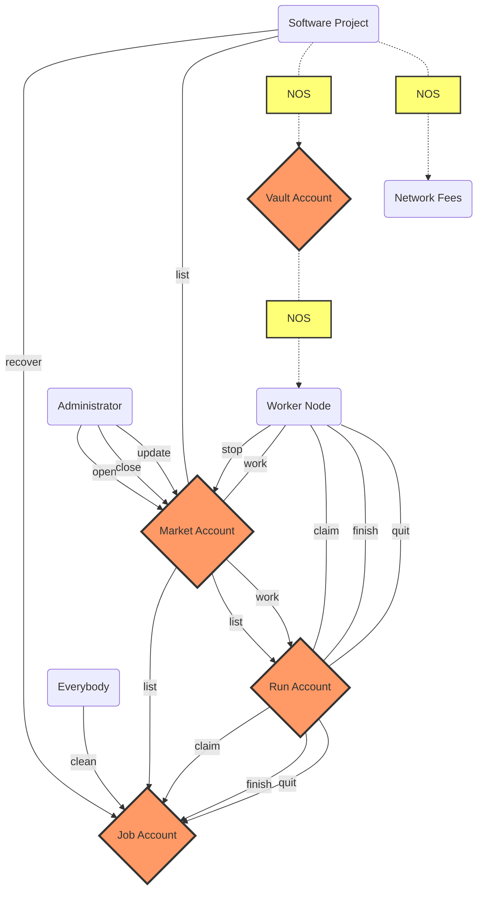
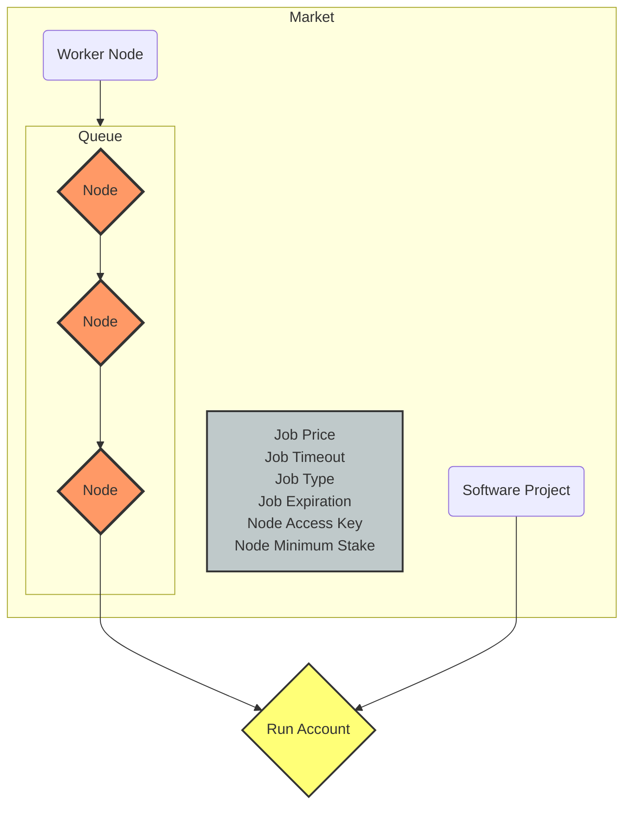
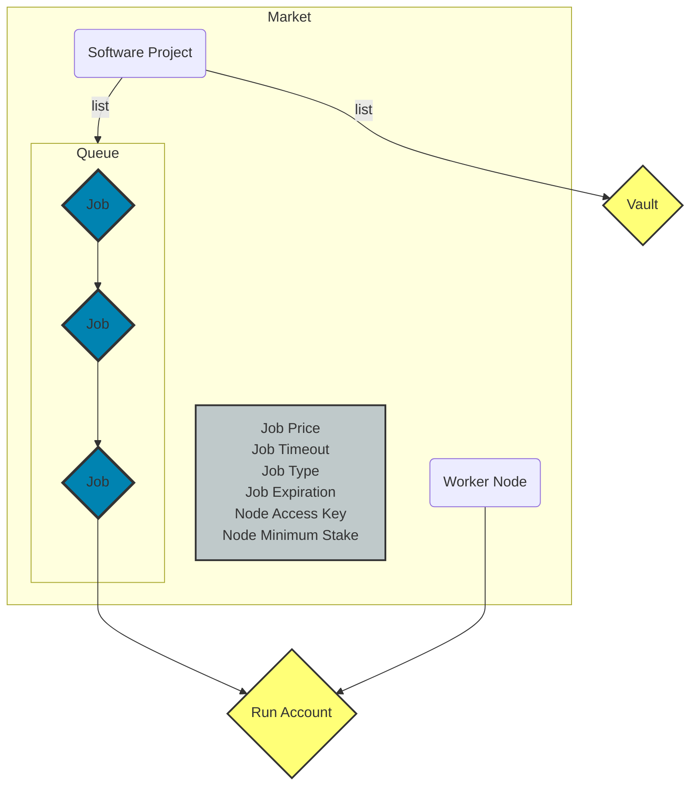
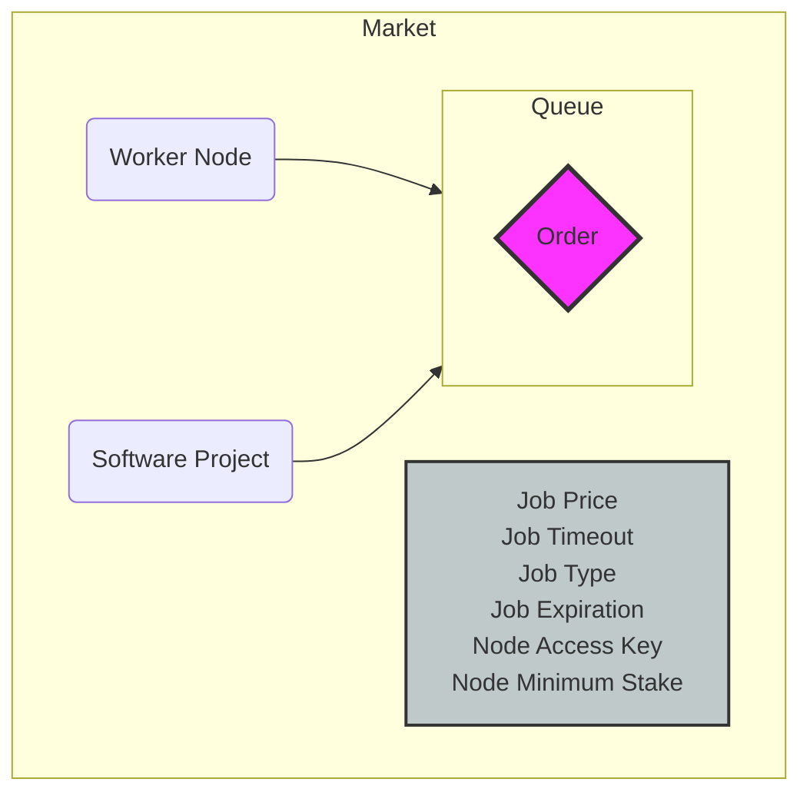

# Nosana Jobs

Projects can post pipeline jobs through the Nosana Jobs program.
It lets nodes in the Nosana Network earn tokens by doing those jobs.

<!-- BEGIN_NOS_DOCS -->

## Program Information

| Info            | Description                                                                                                                         |
|-----------------|-------------------------------------------------------------------------------------------------------------------------------------|
| Type            | [Solana Program](https://docs.solana.com/developing/intro/programs#on-chain-programs)                                               |
| Source Code     | [GitHub](https://github.com/nosana-ci/nosana-programs)                                                                              |
| Build Status    | [Anchor Verified](https://www.apr.dev/program/nosJhNRqr2bc9g1nfGDcXXTXvYUmxD4cVwy2pMWhrYM)                                          |
| Accounts        | [`4`](#accounts)                                                                                                                    |
| Instructions    | [`14`](#instructions)                                                                                                               |
| Types           | [`3`](#types)                                                                                                                       |
| Errors          | [`14`](#errors)                                                                                                                     |
| Domain          | `nosana-jobs.sol`                                                                                                                   |
|  Address        | [`nosJhNRqr2bc9g1nfGDcXXTXvYUmxD4cVwy2pMWhrYM`](https://explorer.solana.com/address/nosJhNRqr2bc9g1nfGDcXXTXvYUmxD4cVwy2pMWhrYM)    |

## Instructions

A number of 14 instruction are defined in the Nosana Jobs program.

To load the program with [Anchor](https://coral-xyz.github.io/anchor/ts/index.html).

```typescript
const programId = new PublicKey('nosJhNRqr2bc9g1nfGDcXXTXvYUmxD4cVwy2pMWhrYM');
const idl = await Program.fetchIdl(programId.toString());
const program = new Program(idl, programId);
```

:::: tabs
@tab Open
### Open

Initialize a [MarketAccount](#market-account) and [VaultAccount](#vault-account).

#### Account Info

The following 8 account addresses should be provided when invoking this instruction.

| Name                   | Type                                                                                    | Description                                                                                       |
|------------------------|-----------------------------------------------------------------------------------------|---------------------------------------------------------------------------------------------------|
| `mint`                 | <FontIcon icon="pencil" color="lightgrey" /><FontIcon icon="key" color="lightgrey" />   | The token Mint address for this instruction.                                                      |
| `market`               | <FontIcon icon="pencil" color="#3EAF7C" /><FontIcon icon="key" color="#3EAF7C" />       | The [MarketAccount](#market-account) address.                                                     |
| `vault`                | <FontIcon icon="pencil" color="#3EAF7C" /><FontIcon icon="key" color="lightgrey" />     | The [VaultAccount](#vault-account) address.                                                       |
| `authority`            | <FontIcon icon="pencil" color="#3EAF7C" /><FontIcon icon="key" color="#3EAF7C" />       | The signing authority of the program invocation.                                                  |
| `accessKey`            | <FontIcon icon="pencil" color="lightgrey" /><FontIcon icon="key" color="lightgrey" />   | The Node Access Key address.                                                                      |
| `rent`                 | <FontIcon icon="pencil" color="lightgrey" /><FontIcon icon="key" color="lightgrey" />   | The official Solana rent address. Responsible for lamports.                                       |
| `systemProgram`        | <FontIcon icon="pencil" color="lightgrey" /><FontIcon icon="key" color="lightgrey" />   | The official Solana system program address. Responsible for system CPIs.                          |
| `tokenProgram`         | <FontIcon icon="pencil" color="lightgrey" /><FontIcon icon="key" color="lightgrey" />   | The official SPL Token Program address. Responsible for token CPIs.                               |

#### Arguments

The following 5 arguments should also be provided when invoking this instruction.

| Name                   | Type              | Size    | Offset  | Description                                               |
|------------------------|-------------------|---------|---------|-----------------------------------------------------------|
| `jobExpiration`        | `i64`             | `16`    | `0`     | The expiration time in seconds for jobs.                  |
| `jobPrice`             | `u64`             | `8`     | `16`    | The price for jobs in this market.                        |
| `jobTimeout`           | `i64`             | `16`    | `24`    | The timeout time in seconds for jobs.                     |
| `jobType`              | `u8`              | `1`     | `40`    | The [JobType](#job-type) number.                          |
| `nodeXnosMinimum`      | `u128`            | `16`    | `41`    | The amount of [`xNOS`](/programs/staking) a node needs to qualify for a market.|


::: details Solana Dispatch ID

The Solana dispatch ID for the Open Instruction
is **`e4dc9b47c7bd3c2d`**,
which can also be expressed as an 8 byte discriminator:

```json
[228,220,155,71,199,189,60,45]
```

:::
::: details Example with Anchor

To invoke the Open Instruction
with [Anchor TS](https://coral-xyz.github.io/anchor/ts/index.html).

```typescript
let tx = await program.methods
  .open(
    jobExpiration,     // type: i64
    jobPrice,          // type: u64
    jobTimeout,        // type: i64
    jobType,           // type: u8
    nodeXnosMinimum,   // type: u128
  )
  .accounts({
    mint,              // 𐄂 writable, 𐄂 signer
    market,            // ✓ writable, ✓ signer
    vault,             // ✓ writable, 𐄂 signer
    authority,         // ✓ writable, ✓ signer
    accessKey,         // 𐄂 writable, 𐄂 signer
    rent,              // 𐄂 writable, 𐄂 signer
    systemProgram,     // 𐄂 writable, 𐄂 signer
    tokenProgram,      // 𐄂 writable, 𐄂 signer
  })
  .signers([marketKey, authorityKey])
  .rpc();
```

@tab Update
### Update

Update a [MarketAccount](#market-account)'s configurations.

#### Account Info

The following 3 account addresses should be provided when invoking this instruction.

| Name                   | Type                                                                                    | Description                                                                                       |
|------------------------|-----------------------------------------------------------------------------------------|---------------------------------------------------------------------------------------------------|
| `market`               | <FontIcon icon="pencil" color="#3EAF7C" /><FontIcon icon="key" color="lightgrey" />     | The [MarketAccount](#market-account) address.                                                     |
| `accessKey`            | <FontIcon icon="pencil" color="lightgrey" /><FontIcon icon="key" color="lightgrey" />   | The Node Access Key address.                                                                      |
| `authority`            | <FontIcon icon="pencil" color="lightgrey" /><FontIcon icon="key" color="#3EAF7C" />     | The signing authority of the program invocation.                                                  |

#### Arguments

The following 4 arguments should also be provided when invoking this instruction.

| Name                   | Type              | Size    | Offset  | Description                                               |
|------------------------|-------------------|---------|---------|-----------------------------------------------------------|
| `jobExpiration`        | `i64`             | `16`    | `0`     | The expiration time in seconds for jobs.                  |
| `jobPrice`             | `u64`             | `8`     | `16`    | The price for jobs in this market.                        |
| `jobType`              | `u8`              | `1`     | `24`    | The [JobType](#job-type) number.                          |
| `nodeStakeMinimum`     | `u128`            | `16`    | `25`    | The amount of [`xNOS`](/programs/staking) a node needs to qualify for a market.|


::: details Solana Dispatch ID

The Solana dispatch ID for the Update Instruction
is **`dbc858b09e3ffd7f`**,
which can also be expressed as an 8 byte discriminator:

```json
[219,200,88,176,158,63,253,127]
```

:::
::: details Example with Anchor

To invoke the Update Instruction
with [Anchor TS](https://coral-xyz.github.io/anchor/ts/index.html).

```typescript
let tx = await program.methods
  .update(
    jobExpiration,     // type: i64
    jobPrice,          // type: u64
    jobType,           // type: u8
    nodeStakeMinimum,  // type: u128
  )
  .accounts({
    market,            // ✓ writable, 𐄂 signer
    accessKey,         // 𐄂 writable, 𐄂 signer
    authority,         // 𐄂 writable, ✓ signer
  })
  .signers([authorityKey])
  .rpc();
```

@tab Close
### Close

Close a [MarketAccount](#market-account) and the associated [VaultAccount](#vault-account).

#### Account Info

The following 5 account addresses should be provided when invoking this instruction.

| Name                   | Type                                                                                    | Description                                                                                       |
|------------------------|-----------------------------------------------------------------------------------------|---------------------------------------------------------------------------------------------------|
| `market`               | <FontIcon icon="pencil" color="#3EAF7C" /><FontIcon icon="key" color="lightgrey" />     | The [MarketAccount](#market-account) address.                                                     |
| `vault`                | <FontIcon icon="pencil" color="#3EAF7C" /><FontIcon icon="key" color="lightgrey" />     | The [VaultAccount](#vault-account) address.                                                       |
| `user`                 | <FontIcon icon="pencil" color="#3EAF7C" /><FontIcon icon="key" color="lightgrey" />     | The user token account that will debit/credit the tokens.                                         |
| `authority`            | <FontIcon icon="pencil" color="lightgrey" /><FontIcon icon="key" color="#3EAF7C" />     | The signing authority of the program invocation.                                                  |
| `tokenProgram`         | <FontIcon icon="pencil" color="lightgrey" /><FontIcon icon="key" color="lightgrey" />   | The official SPL Token Program address. Responsible for token CPIs.                               |


::: details Solana Dispatch ID

The Solana dispatch ID for the Close Instruction
is **`62a5c9b16c41ce60`**,
which can also be expressed as an 8 byte discriminator:

```json
[98,165,201,177,108,65,206,96]
```

:::
::: details Example with Anchor

To invoke the Close Instruction
with [Anchor TS](https://coral-xyz.github.io/anchor/ts/index.html).

```typescript
let tx = await program.methods
  .close()
  .accounts({
    market,            // ✓ writable, 𐄂 signer
    vault,             // ✓ writable, 𐄂 signer
    user,              // ✓ writable, 𐄂 signer
    authority,         // 𐄂 writable, ✓ signer
    tokenProgram,      // 𐄂 writable, 𐄂 signer
  })
  .signers([authorityKey])
  .rpc();
```

@tab Close Admin
### Close Admin

Close a [MarketAccount](#market-account) and the associated [VaultAccount](#vault-account).

#### Account Info

The following 5 account addresses should be provided when invoking this instruction.

| Name                   | Type                                                                                    | Description                                                                                       |
|------------------------|-----------------------------------------------------------------------------------------|---------------------------------------------------------------------------------------------------|
| `market`               | <FontIcon icon="pencil" color="#3EAF7C" /><FontIcon icon="key" color="lightgrey" />     | The [MarketAccount](#market-account) address.                                                     |
| `vault`                | <FontIcon icon="pencil" color="#3EAF7C" /><FontIcon icon="key" color="lightgrey" />     | The [VaultAccount](#vault-account) address.                                                       |
| `user`                 | <FontIcon icon="pencil" color="#3EAF7C" /><FontIcon icon="key" color="lightgrey" />     | The user token account that will debit/credit the tokens.                                         |
| `authority`            | <FontIcon icon="pencil" color="lightgrey" /><FontIcon icon="key" color="#3EAF7C" />     | The signing authority of the program invocation.                                                  |
| `tokenProgram`         | <FontIcon icon="pencil" color="lightgrey" /><FontIcon icon="key" color="lightgrey" />   | The official SPL Token Program address. Responsible for token CPIs.                               |


::: details Solana Dispatch ID

The Solana dispatch ID for the Close Admin Instruction
is **`cab6b98ed0a191bd`**,
which can also be expressed as an 8 byte discriminator:

```json
[202,182,185,142,208,161,145,189]
```

:::
::: details Example with Anchor

To invoke the Close Admin Instruction
with [Anchor TS](https://coral-xyz.github.io/anchor/ts/index.html).

```typescript
let tx = await program.methods
  .closeAdmin()
  .accounts({
    market,            // ✓ writable, 𐄂 signer
    vault,             // ✓ writable, 𐄂 signer
    user,              // ✓ writable, 𐄂 signer
    authority,         // 𐄂 writable, ✓ signer
    tokenProgram,      // 𐄂 writable, 𐄂 signer
  })
  .signers([authorityKey])
  .rpc();
```

@tab List
### List

Create a [JobAccount](#job-account) and optional [RunAccount](#run-account).

#### Account Info

The following 12 account addresses should be provided when invoking this instruction.

| Name                   | Type                                                                                    | Description                                                                                       |
|------------------------|-----------------------------------------------------------------------------------------|---------------------------------------------------------------------------------------------------|
| `job`                  | <FontIcon icon="pencil" color="#3EAF7C" /><FontIcon icon="key" color="#3EAF7C" />       | The [JobAccount](#job-account) address.                                                           |
| `market`               | <FontIcon icon="pencil" color="#3EAF7C" /><FontIcon icon="key" color="lightgrey" />     | The [MarketAccount](#market-account) address.                                                     |
| `run`                  | <FontIcon icon="pencil" color="#3EAF7C" /><FontIcon icon="key" color="#3EAF7C" />       | The [RunAccount](#run-account) address.                                                           |
| `user`                 | <FontIcon icon="pencil" color="#3EAF7C" /><FontIcon icon="key" color="lightgrey" />     | The user token account that will debit/credit the tokens.                                         |
| `vault`                | <FontIcon icon="pencil" color="#3EAF7C" /><FontIcon icon="key" color="lightgrey" />     | The [VaultAccount](#vault-account) address.                                                       |
| `payer`                | <FontIcon icon="pencil" color="#3EAF7C" /><FontIcon icon="key" color="#3EAF7C" />       | The paying identy for the rent.                                                                   |
| `rewardsReflection`    | <FontIcon icon="pencil" color="#3EAF7C" /><FontIcon icon="key" color="lightgrey" />     | The Nosana Rewards Program's [ReflectionAccount](/programs/rewards#reflection-account) address.   |
| `rewardsVault`         | <FontIcon icon="pencil" color="#3EAF7C" /><FontIcon icon="key" color="lightgrey" />     | The Nosana Rewards Program's [VaultAccount](/programs/rewards#vault-account) address.             |
| `authority`            | <FontIcon icon="pencil" color="lightgrey" /><FontIcon icon="key" color="#3EAF7C" />     | The signing authority of the program invocation.                                                  |
| `rewardsProgram`       | <FontIcon icon="pencil" color="lightgrey" /><FontIcon icon="key" color="lightgrey" />   | The [Nosana Rewards](/programs/rewards) Program address.                                          |
| `tokenProgram`         | <FontIcon icon="pencil" color="lightgrey" /><FontIcon icon="key" color="lightgrey" />   | The official SPL Token Program address. Responsible for token CPIs.                               |
| `systemProgram`        | <FontIcon icon="pencil" color="lightgrey" /><FontIcon icon="key" color="lightgrey" />   | The official Solana system program address. Responsible for system CPIs.                          |

#### Arguments

The following 1 arguments should also be provided when invoking this instruction.

| Name                   | Type              | Size    | Offset  | Description                                               |
|------------------------|-------------------|---------|---------|-----------------------------------------------------------|
| `ipfsJob`              | `["u8",32]`       | `32`    | `0`     | The byte array representing the IPFS hash to the job.     |
| `timeout`              | `i64`             | `16`    | `32`    | The timeout time in seconds for this job.                 |


::: details Solana Dispatch ID

The Solana dispatch ID for the List Instruction
is **`36aec14311298426`**,
which can also be expressed as an 8 byte discriminator:

```json
[54,174,193,67,17,41,132,38]
```

:::
::: details Example with Anchor

To invoke the List Instruction
with [Anchor TS](https://coral-xyz.github.io/anchor/ts/index.html).

```typescript
let tx = await program.methods
  .list(
    ipfsJob,           // type: ["u8",32]
    timeout,           // type: i64
  )
  .accounts({
    job,               // ✓ writable, ✓ signer
    market,            // ✓ writable, 𐄂 signer
    run,               // ✓ writable, ✓ signer
    user,              // ✓ writable, 𐄂 signer
    vault,             // ✓ writable, 𐄂 signer
    payer,             // ✓ writable, ✓ signer
    rewardsReflection, // ✓ writable, 𐄂 signer
    rewardsVault,      // ✓ writable, 𐄂 signer
    authority,         // 𐄂 writable, ✓ signer
    rewardsProgram,    // 𐄂 writable, 𐄂 signer
    tokenProgram,      // 𐄂 writable, 𐄂 signer
    systemProgram,     // 𐄂 writable, 𐄂 signer
  })
  .signers([jobKey, runKey, payerKey, authorityKey])
  .rpc();
```

@tab Extend
### Extend

Extend the timeout of a [JobAccount](#job-account).

#### Account Info

The following 9 account addresses should be provided when invoking this instruction.

| Name                   | Type                                                                                    | Description                                                                                       |
|------------------------|-----------------------------------------------------------------------------------------|---------------------------------------------------------------------------------------------------|
| `job`                  | <FontIcon icon="pencil" color="#3EAF7C" /><FontIcon icon="key" color="lightgrey" />     | The [JobAccount](#job-account) address.                                                           |
| `market`               | <FontIcon icon="pencil" color="lightgrey" /><FontIcon icon="key" color="lightgrey" />   | The [MarketAccount](#market-account) address.                                                     |
| `user`                 | <FontIcon icon="pencil" color="#3EAF7C" /><FontIcon icon="key" color="lightgrey" />     | The user token account that will debit/credit the tokens.                                         |
| `vault`                | <FontIcon icon="pencil" color="#3EAF7C" /><FontIcon icon="key" color="lightgrey" />     | The [VaultAccount](#vault-account) address.                                                       |
| `rewardsReflection`    | <FontIcon icon="pencil" color="#3EAF7C" /><FontIcon icon="key" color="lightgrey" />     | The Nosana Rewards Program's [ReflectionAccount](/programs/rewards#reflection-account) address.   |
| `rewardsVault`         | <FontIcon icon="pencil" color="#3EAF7C" /><FontIcon icon="key" color="lightgrey" />     | The Nosana Rewards Program's [VaultAccount](/programs/rewards#vault-account) address.             |
| `authority`            | <FontIcon icon="pencil" color="lightgrey" /><FontIcon icon="key" color="#3EAF7C" />     | The signing authority of the program invocation.                                                  |
| `rewardsProgram`       | <FontIcon icon="pencil" color="lightgrey" /><FontIcon icon="key" color="lightgrey" />   | The [Nosana Rewards](/programs/rewards) Program address.                                          |
| `tokenProgram`         | <FontIcon icon="pencil" color="lightgrey" /><FontIcon icon="key" color="lightgrey" />   | The official SPL Token Program address. Responsible for token CPIs.                               |

#### Arguments

The following 1 arguments should also be provided when invoking this instruction.

| Name                   | Type              | Size    | Offset  | Description                                               |
|------------------------|-------------------|---------|---------|-----------------------------------------------------------|
| `timeout`              | `i64`             | `16`    | `0`     | The new timeout time in seconds for this job.             |


::: details Solana Dispatch ID

The Solana dispatch ID for the Extend Instruction
is **`36aec14311298426`**,
which can also be expressed as an 8 byte discriminator:

```json
[54,174,193,67,17,41,132,38]
```

:::
::: details Example with Anchor

To invoke the Extend Instruction
with [Anchor TS](https://coral-xyz.github.io/anchor/ts/index.html).

```typescript
let tx = await program.methods
  .extend(
    timeout,           // type: i64
  )
  .accounts({
    job,               // ✓ writable, 𐄂 signer
    market,            // 𐄂 writable, 𐄂 signer
    user,              // ✓ writable, 𐄂 signer
    vault,             // ✓ writable, 𐄂 signer
    rewardsReflection, // ✓ writable, 𐄂 signer
    rewardsVault,      // ✓ writable, 𐄂 signer
    authority,         // 𐄂 writable, ✓ signer
    rewardsProgram,    // 𐄂 writable, 𐄂 signer
    tokenProgram,      // 𐄂 writable, 𐄂 signer
  })
  .signers([authorityKey])
  .rpc();
```

@tab Recover
### Recover

Recover funds from a [JobAccount](#job-account) that has been [quit](#quit).

#### Account Info

The following 7 account addresses should be provided when invoking this instruction.

| Name                   | Type                                                                                    | Description                                                                                       |
|------------------------|-----------------------------------------------------------------------------------------|---------------------------------------------------------------------------------------------------|
| `job`                  | <FontIcon icon="pencil" color="#3EAF7C" /><FontIcon icon="key" color="lightgrey" />     | The [JobAccount](#job-account) address.                                                           |
| `market`               | <FontIcon icon="pencil" color="lightgrey" /><FontIcon icon="key" color="lightgrey" />   | The [MarketAccount](#market-account) address.                                                     |
| `vault`                | <FontIcon icon="pencil" color="#3EAF7C" /><FontIcon icon="key" color="lightgrey" />     | The [VaultAccount](#vault-account) address.                                                       |
| `user`                 | <FontIcon icon="pencil" color="#3EAF7C" /><FontIcon icon="key" color="lightgrey" />     | The user token account that will debit/credit the tokens.                                         |
| `payer`                | <FontIcon icon="pencil" color="#3EAF7C" /><FontIcon icon="key" color="lightgrey" />     | The paying identy for the rent.                                                                   |
| `authority`            | <FontIcon icon="pencil" color="lightgrey" /><FontIcon icon="key" color="#3EAF7C" />     | The signing authority of the program invocation.                                                  |
| `tokenProgram`         | <FontIcon icon="pencil" color="lightgrey" /><FontIcon icon="key" color="lightgrey" />   | The official SPL Token Program address. Responsible for token CPIs.                               |


::: details Solana Dispatch ID

The Solana dispatch ID for the Recover Instruction
is **`6cd8263a6d927411`**,
which can also be expressed as an 8 byte discriminator:

```json
[108,216,38,58,109,146,116,17]
```

:::
::: details Example with Anchor

To invoke the Recover Instruction
with [Anchor TS](https://coral-xyz.github.io/anchor/ts/index.html).

```typescript
let tx = await program.methods
  .recover()
  .accounts({
    job,               // ✓ writable, 𐄂 signer
    market,            // 𐄂 writable, 𐄂 signer
    vault,             // ✓ writable, 𐄂 signer
    user,              // ✓ writable, 𐄂 signer
    payer,             // ✓ writable, 𐄂 signer
    authority,         // 𐄂 writable, ✓ signer
    tokenProgram,      // 𐄂 writable, 𐄂 signer
  })
  .signers([authorityKey])
  .rpc();
```

@tab Work
### Work

Enters the [MarketAccount](#market-account) queue, or create  a [RunAccount](#run-account).

#### Account Info

The following 8 account addresses should be provided when invoking this instruction.

| Name                   | Type                                                                                    | Description                                                                                       |
|------------------------|-----------------------------------------------------------------------------------------|---------------------------------------------------------------------------------------------------|
| `run`                  | <FontIcon icon="pencil" color="#3EAF7C" /><FontIcon icon="key" color="#3EAF7C" />       | The [RunAccount](#run-account) address.                                                           |
| `market`               | <FontIcon icon="pencil" color="#3EAF7C" /><FontIcon icon="key" color="lightgrey" />     | The [MarketAccount](#market-account) address.                                                     |
| `payer`                | <FontIcon icon="pencil" color="#3EAF7C" /><FontIcon icon="key" color="#3EAF7C" />       | The paying identy for the rent.                                                                   |
| `stake`                | <FontIcon icon="pencil" color="lightgrey" /><FontIcon icon="key" color="lightgrey" />   | The [StakeAccount](/programs/staking#stake-account) address.                                      |
| `nft`                  | <FontIcon icon="pencil" color="lightgrey" /><FontIcon icon="key" color="lightgrey" />   | The Token Account address that holds the NFT.                                                     |
| `metadata`             | <FontIcon icon="pencil" color="lightgrey" /><FontIcon icon="key" color="lightgrey" />   | The Metaplex Metadata address, that belongs to the NFT.                                           |
| `authority`            | <FontIcon icon="pencil" color="lightgrey" /><FontIcon icon="key" color="#3EAF7C" />     | The signing authority of the program invocation.                                                  |
| `systemProgram`        | <FontIcon icon="pencil" color="lightgrey" /><FontIcon icon="key" color="lightgrey" />   | The official Solana system program address. Responsible for system CPIs.                          |


::: details Solana Dispatch ID

The Solana dispatch ID for the Work Instruction
is **`0f432dc3d789e52f`**,
which can also be expressed as an 8 byte discriminator:

```json
[15,67,45,195,215,137,229,47]
```

:::
::: details Example with Anchor

To invoke the Work Instruction
with [Anchor TS](https://coral-xyz.github.io/anchor/ts/index.html).

```typescript
let tx = await program.methods
  .work()
  .accounts({
    run,               // ✓ writable, ✓ signer
    market,            // ✓ writable, 𐄂 signer
    payer,             // ✓ writable, ✓ signer
    stake,             // 𐄂 writable, 𐄂 signer
    nft,               // 𐄂 writable, 𐄂 signer
    metadata,          // 𐄂 writable, 𐄂 signer
    authority,         // 𐄂 writable, ✓ signer
    systemProgram,     // 𐄂 writable, 𐄂 signer
  })
  .signers([runKey, payerKey, authorityKey])
  .rpc();
```

@tab Stop
### Stop

Exit the node queue from [MarketAccount](#market-account).

#### Account Info

The following 2 account addresses should be provided when invoking this instruction.

| Name                   | Type                                                                                    | Description                                                                                       |
|------------------------|-----------------------------------------------------------------------------------------|---------------------------------------------------------------------------------------------------|
| `market`               | <FontIcon icon="pencil" color="#3EAF7C" /><FontIcon icon="key" color="lightgrey" />     | The [MarketAccount](#market-account) address.                                                     |
| `authority`            | <FontIcon icon="pencil" color="lightgrey" /><FontIcon icon="key" color="#3EAF7C" />     | The signing authority of the program invocation.                                                  |


::: details Solana Dispatch ID

The Solana dispatch ID for the Stop Instruction
is **`2a85203cabfdb89b`**,
which can also be expressed as an 8 byte discriminator:

```json
[42,133,32,60,171,253,184,155]
```

:::
::: details Example with Anchor

To invoke the Stop Instruction
with [Anchor TS](https://coral-xyz.github.io/anchor/ts/index.html).

```typescript
let tx = await program.methods
  .stop()
  .accounts({
    market,            // ✓ writable, 𐄂 signer
    authority,         // 𐄂 writable, ✓ signer
  })
  .signers([authorityKey])
  .rpc();
```

@tab Claim
### Claim

Claim a job that is [stopped](#stop).

#### Account Info

The following 9 account addresses should be provided when invoking this instruction.

| Name                   | Type                                                                                    | Description                                                                                       |
|------------------------|-----------------------------------------------------------------------------------------|---------------------------------------------------------------------------------------------------|
| `job`                  | <FontIcon icon="pencil" color="#3EAF7C" /><FontIcon icon="key" color="lightgrey" />     | The [JobAccount](#job-account) address.                                                           |
| `run`                  | <FontIcon icon="pencil" color="#3EAF7C" /><FontIcon icon="key" color="#3EAF7C" />       | The [RunAccount](#run-account) address.                                                           |
| `market`               | <FontIcon icon="pencil" color="lightgrey" /><FontIcon icon="key" color="lightgrey" />   | The [MarketAccount](#market-account) address.                                                     |
| `stake`                | <FontIcon icon="pencil" color="lightgrey" /><FontIcon icon="key" color="lightgrey" />   | The [StakeAccount](/programs/staking#stake-account) address.                                      |
| `nft`                  | <FontIcon icon="pencil" color="lightgrey" /><FontIcon icon="key" color="lightgrey" />   | The Token Account address that holds the NFT.                                                     |
| `metadata`             | <FontIcon icon="pencil" color="lightgrey" /><FontIcon icon="key" color="lightgrey" />   | The Metaplex Metadata address, that belongs to the NFT.                                           |
| `payer`                | <FontIcon icon="pencil" color="#3EAF7C" /><FontIcon icon="key" color="#3EAF7C" />       | The paying identy for the rent.                                                                   |
| `authority`            | <FontIcon icon="pencil" color="lightgrey" /><FontIcon icon="key" color="#3EAF7C" />     | The signing authority of the program invocation.                                                  |
| `systemProgram`        | <FontIcon icon="pencil" color="lightgrey" /><FontIcon icon="key" color="lightgrey" />   | The official Solana system program address. Responsible for system CPIs.                          |


::: details Solana Dispatch ID

The Solana dispatch ID for the Claim Instruction
is **`3ec6d6c1d59f6cd2`**,
which can also be expressed as an 8 byte discriminator:

```json
[62,198,214,193,213,159,108,210]
```

:::
::: details Example with Anchor

To invoke the Claim Instruction
with [Anchor TS](https://coral-xyz.github.io/anchor/ts/index.html).

```typescript
let tx = await program.methods
  .claim()
  .accounts({
    job,               // ✓ writable, 𐄂 signer
    run,               // ✓ writable, ✓ signer
    market,            // 𐄂 writable, 𐄂 signer
    stake,             // 𐄂 writable, 𐄂 signer
    nft,               // 𐄂 writable, 𐄂 signer
    metadata,          // 𐄂 writable, 𐄂 signer
    payer,             // ✓ writable, ✓ signer
    authority,         // 𐄂 writable, ✓ signer
    systemProgram,     // 𐄂 writable, 𐄂 signer
  })
  .signers([runKey, payerKey, authorityKey])
  .rpc();
```

@tab Finish
### Finish

Post the result for a  [JobAccount](#job-account) to finish it and get paid.

#### Account Info

The following 10 account addresses should be provided when invoking this instruction.

| Name                   | Type                                                                                    | Description                                                                                       |
|------------------------|-----------------------------------------------------------------------------------------|---------------------------------------------------------------------------------------------------|
| `job`                  | <FontIcon icon="pencil" color="#3EAF7C" /><FontIcon icon="key" color="lightgrey" />     | The [JobAccount](#job-account) address.                                                           |
| `run`                  | <FontIcon icon="pencil" color="#3EAF7C" /><FontIcon icon="key" color="lightgrey" />     | The [RunAccount](#run-account) address.                                                           |
| `market`               | <FontIcon icon="pencil" color="lightgrey" /><FontIcon icon="key" color="lightgrey" />   | The [MarketAccount](#market-account) address.                                                     |
| `vault`                | <FontIcon icon="pencil" color="#3EAF7C" /><FontIcon icon="key" color="lightgrey" />     | The [VaultAccount](#vault-account) address.                                                       |
| `user`                 | <FontIcon icon="pencil" color="#3EAF7C" /><FontIcon icon="key" color="lightgrey" />     | The user token account that will debit/credit the tokens.                                         |
| `deposit`              | <FontIcon icon="pencil" color="#3EAF7C" /><FontIcon icon="key" color="lightgrey" />     | n/a                                                                                               |
| `payer`                | <FontIcon icon="pencil" color="#3EAF7C" /><FontIcon icon="key" color="lightgrey" />     | The paying identy for the rent.                                                                   |
| `project`              | <FontIcon icon="pencil" color="#3EAF7C" /><FontIcon icon="key" color="lightgrey" />     | The project that listed this job.                                                                 |
| `authority`            | <FontIcon icon="pencil" color="lightgrey" /><FontIcon icon="key" color="#3EAF7C" />     | The signing authority of the program invocation.                                                  |
| `tokenProgram`         | <FontIcon icon="pencil" color="lightgrey" /><FontIcon icon="key" color="lightgrey" />   | The official SPL Token Program address. Responsible for token CPIs.                               |

#### Arguments

The following 1 arguments should also be provided when invoking this instruction.

| Name                   | Type              | Size    | Offset  | Description                                               |
|------------------------|-------------------|---------|---------|-----------------------------------------------------------|
| `ipfsResult`           | `["u8",32]`       | `32`    | `0`     | The byte array representing the IPFS hash to the results. |


::: details Solana Dispatch ID

The Solana dispatch ID for the Finish Instruction
is **`434aaa847de9b625`**,
which can also be expressed as an 8 byte discriminator:

```json
[67,74,170,132,125,233,182,37]
```

:::
::: details Example with Anchor

To invoke the Finish Instruction
with [Anchor TS](https://coral-xyz.github.io/anchor/ts/index.html).

```typescript
let tx = await program.methods
  .finish(
    ipfsResult,        // type: ["u8",32]
  )
  .accounts({
    job,               // ✓ writable, 𐄂 signer
    run,               // ✓ writable, 𐄂 signer
    market,            // 𐄂 writable, 𐄂 signer
    vault,             // ✓ writable, 𐄂 signer
    user,              // ✓ writable, 𐄂 signer
    deposit,           // ✓ writable, 𐄂 signer
    payer,             // ✓ writable, 𐄂 signer
    project,           // ✓ writable, 𐄂 signer
    authority,         // 𐄂 writable, ✓ signer
    tokenProgram,      // 𐄂 writable, 𐄂 signer
  })
  .signers([authorityKey])
  .rpc();
```

@tab Quit
### Quit

Quit a [JobAccount](#job-account) that you have started.

#### Account Info

The following 4 account addresses should be provided when invoking this instruction.

| Name                   | Type                                                                                    | Description                                                                                       |
|------------------------|-----------------------------------------------------------------------------------------|---------------------------------------------------------------------------------------------------|
| `job`                  | <FontIcon icon="pencil" color="#3EAF7C" /><FontIcon icon="key" color="lightgrey" />     | The [JobAccount](#job-account) address.                                                           |
| `run`                  | <FontIcon icon="pencil" color="#3EAF7C" /><FontIcon icon="key" color="lightgrey" />     | The [RunAccount](#run-account) address.                                                           |
| `payer`                | <FontIcon icon="pencil" color="#3EAF7C" /><FontIcon icon="key" color="lightgrey" />     | The paying identy for the rent.                                                                   |
| `authority`            | <FontIcon icon="pencil" color="lightgrey" /><FontIcon icon="key" color="#3EAF7C" />     | The signing authority of the program invocation.                                                  |


::: details Solana Dispatch ID

The Solana dispatch ID for the Quit Instruction
is **`bf678df050816799`**,
which can also be expressed as an 8 byte discriminator:

```json
[191,103,141,240,80,129,103,153]
```

:::
::: details Example with Anchor

To invoke the Quit Instruction
with [Anchor TS](https://coral-xyz.github.io/anchor/ts/index.html).

```typescript
let tx = await program.methods
  .quit()
  .accounts({
    job,               // ✓ writable, 𐄂 signer
    run,               // ✓ writable, 𐄂 signer
    payer,             // ✓ writable, 𐄂 signer
    authority,         // 𐄂 writable, ✓ signer
  })
  .signers([authorityKey])
  .rpc();
```

@tab Quit Admin
### Quit Admin

Quit a [JobAccount](#job-account) that you have started.

#### Account Info

The following 3 account addresses should be provided when invoking this instruction.

| Name                   | Type                                                                                    | Description                                                                                       |
|------------------------|-----------------------------------------------------------------------------------------|---------------------------------------------------------------------------------------------------|
| `run`                  | <FontIcon icon="pencil" color="#3EAF7C" /><FontIcon icon="key" color="lightgrey" />     | The [RunAccount](#run-account) address.                                                           |
| `payer`                | <FontIcon icon="pencil" color="#3EAF7C" /><FontIcon icon="key" color="lightgrey" />     | The paying identy for the rent.                                                                   |
| `authority`            | <FontIcon icon="pencil" color="lightgrey" /><FontIcon icon="key" color="#3EAF7C" />     | The signing authority of the program invocation.                                                  |


::: details Solana Dispatch ID

The Solana dispatch ID for the Quit Admin Instruction
is **`67ee6e08b61438c4`**,
which can also be expressed as an 8 byte discriminator:

```json
[103,238,110,8,182,20,56,196]
```

:::
::: details Example with Anchor

To invoke the Quit Admin Instruction
with [Anchor TS](https://coral-xyz.github.io/anchor/ts/index.html).

```typescript
let tx = await program.methods
  .quitAdmin()
  .accounts({
    run,               // ✓ writable, 𐄂 signer
    payer,             // ✓ writable, 𐄂 signer
    authority,         // 𐄂 writable, ✓ signer
  })
  .signers([authorityKey])
  .rpc();
```

@tab Clean
### Clean

Close an [JobAccount](#job-account).

#### Account Info

The following 3 account addresses should be provided when invoking this instruction.

| Name                   | Type                                                                                    | Description                                                                                       |
|------------------------|-----------------------------------------------------------------------------------------|---------------------------------------------------------------------------------------------------|
| `job`                  | <FontIcon icon="pencil" color="#3EAF7C" /><FontIcon icon="key" color="lightgrey" />     | The [JobAccount](#job-account) address.                                                           |
| `market`               | <FontIcon icon="pencil" color="lightgrey" /><FontIcon icon="key" color="lightgrey" />   | The [MarketAccount](#market-account) address.                                                     |
| `payer`                | <FontIcon icon="pencil" color="#3EAF7C" /><FontIcon icon="key" color="lightgrey" />     | The paying identy for the rent.                                                                   |


::: details Solana Dispatch ID

The Solana dispatch ID for the Clean Instruction
is **`fabf388096fb0167`**,
which can also be expressed as an 8 byte discriminator:

```json
[250,191,56,128,150,251,1,103]
```

:::
::: details Example with Anchor

To invoke the Clean Instruction
with [Anchor TS](https://coral-xyz.github.io/anchor/ts/index.html).

```typescript
let tx = await program.methods
  .clean()
  .accounts({
    job,               // ✓ writable, 𐄂 signer
    market,            // 𐄂 writable, 𐄂 signer
    payer,             // ✓ writable, 𐄂 signer
  })
  .rpc();
```

@tab Clean Admin
### Clean Admin

Close an [JobAccount](#job-account) as an admin.

#### Account Info

The following 3 account addresses should be provided when invoking this instruction.

| Name                   | Type                                                                                    | Description                                                                                       |
|------------------------|-----------------------------------------------------------------------------------------|---------------------------------------------------------------------------------------------------|
| `job`                  | <FontIcon icon="pencil" color="#3EAF7C" /><FontIcon icon="key" color="lightgrey" />     | The [JobAccount](#job-account) address.                                                           |
| `payer`                | <FontIcon icon="pencil" color="#3EAF7C" /><FontIcon icon="key" color="lightgrey" />     | The paying identy for the rent.                                                                   |
| `authority`            | <FontIcon icon="pencil" color="lightgrey" /><FontIcon icon="key" color="#3EAF7C" />     | The signing authority of the program invocation.                                                  |


::: details Solana Dispatch ID

The Solana dispatch ID for the Clean Admin Instruction
is **`f55abc44fdebab69`**,
which can also be expressed as an 8 byte discriminator:

```json
[245,90,188,68,253,235,171,105]
```

:::
::: details Example with Anchor

To invoke the Clean Admin Instruction
with [Anchor TS](https://coral-xyz.github.io/anchor/ts/index.html).

```typescript
let tx = await program.methods
  .cleanAdmin()
  .accounts({
    job,               // ✓ writable, 𐄂 signer
    payer,             // ✓ writable, 𐄂 signer
    authority,         // 𐄂 writable, ✓ signer
  })
  .signers([authorityKey])
  .rpc();
```

:::
::::
## Accounts

A number of 4 accounts make up for the Nosana Jobs Program's state.

:::: tabs

@tab Market Account
### Market Account

The `MarketAccount` struct holds all the information about jobs and the nodes queue.
The total size of this account is `10,211` bytes.

| Name                        | Type                        | Size    | Offset  | Description                                                                                       |
|-----------------------------|-----------------------------|---------|---------|---------------------------------------------------------------------------------------------------|
| `authority`                 | `publicKey`                 | `32`    | `8`     | The signing authority of the program invocation.                                                  |
| `jobExpiration`             | `i64`                       | `16`    | `40`    | The expiration time in seconds for jobs.                                                          |
| `jobPrice`                  | `u64`                       | `8`     | `56`    | The price for jobs in this market.                                                                |
| `jobTimeout`                | `i64`                       | `16`    | `64`    | The timeout time in seconds for jobs.                                                             |
| `jobType`                   | `u8`                        | `1`     | `80`    | The [JobType](#job-type) number.                                                                  |
| `vault`                     | `publicKey`                 | `32`    | `81`    | The [VaultAccount](#vault-account) address.                                                       |
| `vaultBump`                 | `u8`                        | `1`     | `113`   | The bump for the [VaultAccount](#vault-account).                                                  |
| `nodeAccessKey`             | `publicKey`                 | `32`    | `114`   | The NFT collection address of an NFT that the node holds, in order to access this market.         |
| `nodeXnosMinimum`           | `u128`                      | `16`    | `146`   | The amount of [`xNOS`](/programs/staking) a node needs to qualify for a market.                   |
| `queueType`                 | `u8`                        | `1`     | `162`   | The [QueueType](#queue-type) of the queue. Either Nodes or Jobs.                                  |
| `queue`                     | `Vec<publicKey>`            | `10048` | `163`   | The queue of order in the market.                                                                 |

::: details Anchor Account Discriminator

The first 8 bytes, also known as Anchor's 8 byte discriminator, for the Market Account
are **`c94ebbe1f0c6c9fb`**, which can also be expressed in byte array:

```json
[201,78,187,225,240,198,201,251]
```

@tab Job Account
### Job Account

The `JobAccount` struct holds all the information about any individual jobs.
The total size of this account is `241` bytes.

| Name                        | Type                        | Size    | Offset  | Description                                                                                       |
|-----------------------------|-----------------------------|---------|---------|---------------------------------------------------------------------------------------------------|
| `ipfsJob`                   | `["u8",32]`                 | `32`    | `8`     | The byte array representing the IPFS hash to the job.                                             |
| `ipfsResult`                | `["u8",32]`                 | `32`    | `40`    | The byte array representing the IPFS hash to the results.                                         |
| `market`                    | `publicKey`                 | `32`    | `72`    | The [MarketAccount](#market-account) address.                                                     |
| `node`                      | `publicKey`                 | `32`    | `104`   | The node that runs this job.                                                                      |
| `payer`                     | `publicKey`                 | `32`    | `136`   | The paying identy for the rent.                                                                   |
| `price`                     | `u64`                       | `8`     | `168`   | The price in [$NOS](/tokens/token).                                                               |
| `project`                   | `publicKey`                 | `32`    | `176`   | The project that listed this job.                                                                 |
| `state`                     | `u8`                        | `1`     | `208`   | n/a                                                                                               |
| `timeEnd`                   | `i64`                       | `16`    | `209`   | The unix time this job has finished running.                                                      |
| `timeStart`                 | `i64`                       | `16`    | `225`   | The unix time this job has started running.                                                       |

::: details Anchor Account Discriminator

The first 8 bytes, also known as Anchor's 8 byte discriminator, for the Job Account
are **`5b10a2052dd27d41`**, which can also be expressed in byte array:

```json
[91,16,162,5,45,210,125,65]
```

@tab Run Account
### Run Account

The `RunAccount` struct holds temporary information that matches nodes to jobs.
The total size of this account is `121` bytes.

| Name                        | Type                        | Size    | Offset  | Description                                                                                       |
|-----------------------------|-----------------------------|---------|---------|---------------------------------------------------------------------------------------------------|
| `job`                       | `publicKey`                 | `32`    | `8`     | The [JobAccount](#job-account) address.                                                           |
| `node`                      | `publicKey`                 | `32`    | `40`    | The node that runs this job.                                                                      |
| `payer`                     | `publicKey`                 | `32`    | `72`    | The paying identy for the rent.                                                                   |
| `state`                     | `u8`                        | `1`     | `104`   | n/a                                                                                               |
| `time`                      | `i64`                       | `16`    | `105`   | n/a                                                                                               |

::: details Anchor Account Discriminator

The first 8 bytes, also known as Anchor's 8 byte discriminator, for the Run Account
are **`c2a96ee6eb0be116`**, which can also be expressed in byte array:

```json
[194,169,110,230,235,11,225,22]
```

:::

@tab Vault Account
### Vault Account

The `VaultAccount` is a regular Solana Token Account.

::::

## Types

A number of 3 type variants are defined in the Nosana Jobs Program's state.

::: tabs
@tab Queue Type
### Queue Type


The `QueueType` describes the type of queue

A number of 3 variants are defined in this `enum`:
| Name                                  | Number                                |
|---------------------------------------|---------------------------------------|
| `Job`                                 | `0`                                   |
| `Node`                                | `1`                                   |
| `Empty`                               | `2`                                   |

@tab Job State
### Job State


The `JobState` describes the status of a job.

A number of 3 variants are defined in this `enum`:
| Name                                  | Number                                |
|---------------------------------------|---------------------------------------|
| `Queued`                              | `0`                                   |
| `Done`                                | `1`                                   |
| `Stopped`                             | `2`                                   |

@tab Job Type
### Job Type


The `JobType` describes the type of any job.

A number of 6 variants are defined in this `enum`:
| Name                                  | Number                                |
|---------------------------------------|---------------------------------------|
| `Default`                             | `0`                                   |
| `Small`                               | `1`                                   |
| `Medium`                              | `2`                                   |
| `Large`                               | `3`                                   |
| `Gpu`                                 | `4`                                   |
| `Unknown`                             | `255`                                 |

:::

## Errors

A number of 14 errors are defined in the Nosana Jobs Program.

:::: tabs

@tab 6000

::: warning Nosana Error

### `6000` - Invalid Market Account

This market account is not valid.

:::

@tab 6001

::: warning Nosana Error

### `6001` - Invalid Job Account

This job account is not valid.

:::

@tab 6002

::: warning Nosana Error

### `6002` - Job In Wrong State

This job does not have the right status.

:::

@tab 6003

::: warning Nosana Error

### `6003` - Job Not Expired

The job has not yet expired.

:::

@tab 6004

::: warning Nosana Error

### `6004` - Job Result Null

The job result can not be null.

:::

@tab 6005

::: warning Nosana Error

### `6005` - Job Invalid Project

The job has a different project owner.

:::

@tab 6006

::: warning Nosana Error

### `6006` - Node Queue Does Not Match

This node queue does not match.

:::

@tab 6007

::: warning Nosana Error

### `6007` - Node Stake Unauthorized

This node is not authorizing this stake.

:::

@tab 6008

::: warning Nosana Error

### `6008` - Node Not Enough Stake

This node has not staked enough tokens.

:::

@tab 6009

::: warning Nosana Error

### `6009` - Node Already Queued

This node is already present in the queue.

:::

@tab 6010

::: warning Nosana Error

### `6010` - Node Nft Wrong Metadata

This metadata does not have the correct address.

:::

@tab 6011

::: warning Nosana Error

### `6011` - Node Nft Wrong Owner

This NFT is not owned by this node.

:::

@tab 6012

::: warning Nosana Error

### `6012` - Node Nft Invalid Amount

Access NFT amount cannot be 0.

:::

@tab 6013

::: warning Nosana Error

### `6013` - Node Key Invalid Collection

This access key does not belong to a verified collection.

:::

::::

## Diagram

### Instruction Diagram



### Queue Diagrams

Below a representation of the functioning for the different [QueueTypes](#queue-type).

::: tabs

@tab Node Queue
#### Node

When there a more nodes than jobs in a given Market, the queue will fill up with nodes.
The [`QueueType`](#queue-type) will be `Node` in this case.



@tab Job Queue
#### Job Queue

Vise versa, When there a more jobs than nodes in a given Market, the queue will fill up with jobs.
The [`QueueType`](#queue-type) will be `Job` in this case.



@tab Empty Queue
#### Empty Queue

Finally, at the point when the market is satisfied, the queue will be empty.
The [`QueueType`](#queue-type) will be `Unknown` in this case.



:::

<!-- END_NOS_DOCS -->
