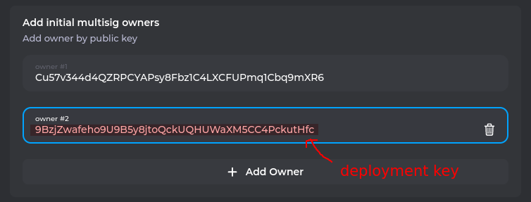
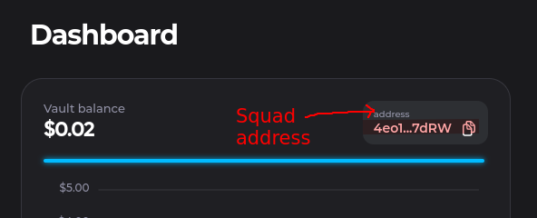
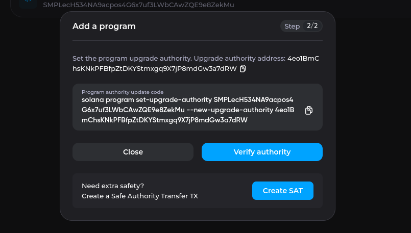
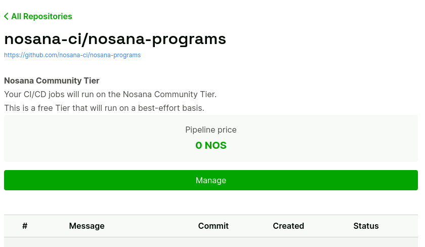
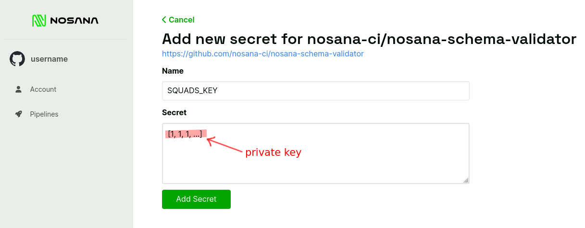

# Multi-signature program deployments on Solana


## Introduction

This tutorial will guide you through the process of setting up a multi-signature upgrade authority for your Solana programs.
We will also set up an automated deployment pipeline so program upgrades are less error-prone and take minimal effort.
In the end, you will have a production-ready deployment flow suited for any type of organization.

You will learn how to:

- Configure a multi-signature program using [Squads](https://squads.so)
- Set up a Nosana pipeline to build and test your code
- Use Nosana to verify your build artifact and only deploy when needed
- Review and execute program upgrades on Squads

## Background

Programs deployed on the Solana blockchain can be updated by an upgrade authority.
Most programs out there use a single key upgrade authority, which means that one keypair is allowed to update the on-chain code.
This is convenient when you are developing your program but it also exposes big security risks.
For one, if your key gets leaked, an adversary can get full control over your program and your user's funds that are managed by it.
The good news is that a multi-signature removes these security concerns and is more convenient at the same time.

## Prerequisites

Before we begin, you will need the following:

- A Solana program already deployed on the Solana mainnet
- Access to the current upgrade authority of your program
- The [Solana Tool Suite](https://docs.solana.com/cli/install-solana-cli-tools) installed on your machine

## Step 1: Create a deployment key

We will first set up a Solana wallet that will be used to initiate our deployments.
This wallet needs to have enough SOL balance to pay for the deployment.

```sh
$ solana-keygen new --no-bip39-passphrase -s -o ci.json
```

This command will generate a new keypair and store the private key in the `ci.json` file.
To get the address of the new keypair, run the following command:

```sh
$ solana address -k ci.json
```

This will output the public address of the new keypair.
Copy this address, as you will need it in a later step.

::: warning
It is recommended that you create a new keypair for the deployment key.
As this key is stored inside the CI/CD platform its privileges and funds should be kept to a minimum.
:::

## Step 2: Set up the Squad

Next, we will set up a Squad, which is a group of signers who will collectively approve program upgrades.
Each member of the Squad will have their own private key, and program upgrades will only be executed if a specified number of signers approve the upgrade.

The initial Squad will consist of your personal wallet that you will use to approve program upgrades and the deployment key we created above.

Open your browser and navigate to the Squads application at https://v3.squads.so.
Then log in with your wallet and click on "Create Squad".
You can make up a name and description here.
In the next screen, add a new owner and fill in the deployment key from step 1:



Here you can add any other members that you would like to be part of the initial multisig owners.

It is recommeneded to have a threshold of at least 2 since the deployment key added as a second signer is considered a "hot key" and should not be able to authorize program upgrades alone.

Now, you should review the settings and create your Squad.
On the dashboard screen you will now see your **Squad address**, save it somewhere as we will need to later on:



## Step 3: Change the upgrade authority

Now that we have created the Squad, we need to change the upgrade authority of our program to the Squads public key.
To do this, to navigate to "Developers -> Programs" inside the Squads navigation menu.
Then click on "Add new program", enter you programs address, and follow the instructions to change upgrade authoirty:



Your Squad is now authorized to make updates to your Solana program and the program has been added to your Squad UI.
Click on the program in the Programs list to bring you to the Upgrades page.
From here you will have to copy the **Squad Program address** from the address bar of our browser.
This is the address that is in the last component of the URL:


The URL will look like this: `https://v3.squads.so/developers/programs/<ABCDEFG...12345>/<12345...ABCDEFG>`
Copy the last piece of URL after the / and keep it safe, as we will need it later.

## Step 4: Configure the Nosana pipeline

Nosana is a deployment tool that allows you to automate the deployment process for Solana programs.
In this step, we will set up a pipeline that builds and tests our program, verifies the build artifact, and deploys the multisig buffer if needed.

### Write a pipeline

Create a `.nosana-ci.yml` file in the root directory of your project, and add the following contents. Also make sure to fill in the 4 values at the top of the file:

```yaml
global:
  image: projectserum/build:v0.27.0
  environment:
    PROGRAM_ID: ...  # Fill in your program's address
    SQUADS_AUTHORITY_PUBKEY: ... # Fill in your deployment key from Step 1
    SQUADS_MULTISIG_PUBKEY: ... # Fill in your Squad address from Step 2
    SQUADS_PROGRAM_PUBKEY: ... # Fill in your Squad program address from Step 3
    # Leave the following unchanged:
    PRIVATE_KEY_PATH: /root/.config/solana/id.json
    SOLANA_URL: mainnet-beta

  # Trigger pipeline on these branches:
  trigger:
    push:
      branches: '*'

jobs:
  # If you use a different build tool than Anchor, this should be customized
  - name: build
    commands:
      - anchor build
    artifacts:
      - name: programs
        path: target

# Uncomment this if you want to add Anchor test step
#  - name: test
#    secrets:
#      - TEST_KEY
#    commands:
#      - echo "${TEST_KEY}" > "${PRIVATE_KEY_PATH}"
#      - npm ci
#      - anchor test
#    resources:
#      - name: programs
#        path: .

  - name: deliver
    image: nosana/solana:v1.0.16
    secrets:
      - SQUADS_KEY
    commands:
      - solana config set --url "${SOLANA_URL}"
      - REMOTE_HASH="$(solana-verify get-program-hash "${PROGRAM_ID}")"
      - echo "On chain hash is ${REMOTE_HASH}"
      - LOCAL_HASH="$(solana-verify get-executable-hash "target/deploy/${PROGRAM_NAME}.so")"
      - echo "Compiled hash is ${LOCAL_HASH}"
      - |
        if [ "${REMOTE_HASH}" = "${LOCAL_HASH}" ]
        then
          echo Programs are equal, deployment cancelled
          exit 0
        else
          echo Continue deployment
        fi
      - echo "${SQUADS_KEY}" > "${PRIVATE_KEY_PATH}"
      - BUFFER_ACCOUNT="$(solana program write-buffer "target/deploy/${PROGRAM_NAME}.so" | cut -d ' ' -f2)"
      - if [ -z "${BUFFER_ACCOUNT}" ]; then exit 1; else echo "Buffer account is ${BUFFER_ACCOUNT}"; fi
      - solana program set-buffer-authority "${BUFFER_ACCOUNT}" --new-buffer-authority "${SQUADS_AUTHORITY_PUBKEY}"
      - |
        nosana-cli create-program-upgrade            \
          --name        upgradeProgram               \
          --private-key "${PRIVATE_KEY_PATH}"        \
          --buffer      "${BUFFER_ACCOUNT}"          \
          --spill       "$(solana address)"          \
          --network     "${SOLANA_URL}"              \
          --multisig    "${SQUADS_MULTISIG_PUBKEY}"  \
          --program     "${SQUADS_PROGRAM_PUBKEY}"   \
          --authority   "${SQUADS_AUTHORITY_PUBKEY}" \
          --approve
    resources:
      - name: programs
        path: .
```

There are 3 steps defined in this pipeline:

1. The build step, this is where the pipeline compiles your code into an `.so` file.
The pipeline uses the `projectserum/build:v0.27.0` Docker image for the build, but you should change both the image and the build commands to fit your project.

2. The test step, this is where the pipeline tests the program before deployment.
If any tests fail, the deployment will not continue.
This step has been commented out in the example, but it is recommended to run you tests here.

3. The deployment step, this is where the pipeline creates a new buffer for the program and proposes it to your Squad.
For this step you will have to pay SOL as rent for the new buffer, which is paid by the deployment key.
The pipeline checks if the compiled code is different from the on-chain code to avoid deploying unnecessary buffers.
Note that this step does not change anything in your actual program, it only proposes an update in your Squad.

### Configure your project

Next, log in to Nosana and add your repository:

- Open your browser and go https://app.nosana.io
- Click on "Login with Github"
- Add your program's Github repository and install the Nosana app
- Click "Add Selected" to add the repository to Nosana

After completing these steps, you should be able to see your repository listed in the "Pipelines" section.



We must now add the deployment private key as a secret to the Nosana project so that our pipeline has access to it.
Navigate to "Manage -> Secrets -> New Secret".
For the secret's name enter `SQUADS_KEY` and for the secret value paste the content of your `ci.json` file from Step 1:



## Step 5: Deploy your program

With everything set up and ready, it's time to deploy your Solana program using the new multi-signature.
We will use a Nosana pipeline to build the program and prepare the buffer, and then use Squads to authorize the actual program upgrade.
Here's how you can do it:

- Make sure you have enough SOL balance in your deployment wallet to pay for the rent of the buffer. If not, transfer some SOL to it.
- Trigger the pipeline by pushing changes to your code repository.
- The pipeline will automatically build and test your code, verify the build artifact, and initialize the buffer only if it's necessary.
- When the pipeline finishes a transaction will be awaiting approval in your Squad.
- Once the Squads transaction is approved and executed, the program upgrade is finished.

Congratulations! You have successfully deployed your Solana program using a multi-signature upgrade authority and automated deployment pipeline.

::: info
The buffer rent can get quite expensive for larger programs, but you will receive the rent back once the upgrade is succesfull or cancelled.
Over time your deployment account will only consume small amounts of SOL for transaction fees.
:::

### Cleaning up cancelled deployments

If you want to abort a multisig deployment created by this pipeline, the transaction can be removed in the Squads interface.
However, at the momement this does not frees the buffer or sends the rent back to your deployment key.
The following command can be used to close the buffer accounts after cancelling the deployment in Squads:

```sh
solana -k ci.json -u m program close --buffers
```

## Conclusion

In this tutorial, you have learned how to set up a multi-signature upgrade authority for your Solana programs, and how to use an automated deployment pipeline to streamline the deployment process.
By using a multi-signature authority, you have greatly reduced the risk of a security breach, and by automating the deployment process, you have minimized the risk of human error.

By implementing these best practices, you can ensure that your Solana programs are always up-to-date and secure, and increase the trust for your users.
We hope this tutorial has been helpful, and we look forward to seeing your Solana programs in action!

## Further Reading

- [Nosana documentation](https://docs.nosana.io)
- [Squads documentation](https://docs.squads.so/squads-docs/)
